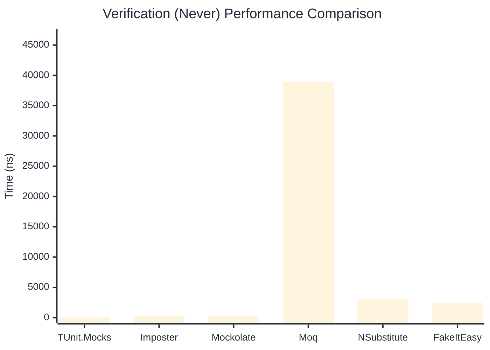

# Verification Benchmark

> Verifying mock method calls — comparing **TUnit.Mocks** (source-generated) against runtime proxy-based mocking libraries.

:::info Last Updated
This benchmark was automatically generated on **2026-09-15** from the latest CI run.

**Environment:** Ubuntu Latest • .NET SDK 10.0.401
:::

## 📊 Results

Verifying mock method calls:

| Library | Mean | Error | StdDev | Allocated |
|---------|------|-------|--------|-----------|
| **TUnit.Mocks** | 676.83 ns | 12.989 ns | 12.757 ns | 3008 B |
| Imposter | 634.95 ns | 12.359 ns | 20.306 ns | 4688 B |
| Mockolate | 406.44 ns | 8.047 ns | 7.903 ns | 2128 B |
| Moq | 160,473.72 ns | 1,599.027 ns | 1,495.731 ns | 24338 B |
| NSubstitute | 6,187.50 ns | 94.801 ns | 88.677 ns | 10064 B |
| FakeItEasy | 5,283.56 ns | 85.835 ns | 88.147 ns | 10719 B |

```mermaid
%%{init: {
  'theme':'base',
  'themeVariables': {
    'primaryColor': '#2563eb',
    'primaryTextColor': '#1f2937',
    'primaryBorderColor': '#1e40af',
    'lineColor': '#6b7280',
    'secondaryColor': '#7c3aed',
    'tertiaryColor': '#dc2626',
    'background': '#ffffff',
    'pie1': '#2563eb',
    'pie2': '#7c3aed',
    'pie3': '#dc2626',
    'pie4': '#f59e0b',
    'pie5': '#10b981',
    'pie6': '#06b6d4',
    'pie7': '#ec4899',
    'pie8': '#6366f1'
  }
}}%%
xychart-beta
  title "Verification Performance Comparison"
  x-axis ["TUnit.Mocks", "Imposter", "Mockolate", "Moq", "NSubstitute", "FakeItEasy"]
  y-axis "Time (ns)" 0 --> 192569
  bar [676.83, 634.95, 406.44, 160473.72, 6187.5, 5283.56]
```

---

### Never

| Library | Mean | Error | StdDev | Allocated |
|---------|------|-------|--------|-----------|
| **TUnit.Mocks** | 47.65 ns | 0.540 ns | 0.478 ns | 320 B |
| Imposter | 274.51 ns | 5.115 ns | 4.272 ns | 2400 B |
| Mockolate | 210.22 ns | 2.783 ns | 2.603 ns | 1144 B |
| Moq | 38,939.23 ns | 221.971 ns | 196.772 ns | 6922 B |
| NSubstitute | 3,021.31 ns | 54.231 ns | 53.262 ns | 7088 B |
| FakeItEasy | 2,468.50 ns | 47.622 ns | 65.186 ns | 5209 B |

```mermaid
%%{init: {
  'theme':'base',
  'themeVariables': {
    'primaryColor': '#2563eb',
    'primaryTextColor': '#1f2937',
    'primaryBorderColor': '#1e40af',
    'lineColor': '#6b7280',
    'secondaryColor': '#7c3aed',
    'tertiaryColor': '#dc2626',
    'background': '#ffffff',
    'pie1': '#2563eb',
    'pie2': '#7c3aed',
    'pie3': '#dc2626',
    'pie4': '#f59e0b',
    'pie5': '#10b981',
    'pie6': '#06b6d4',
    'pie7': '#ec4899',
    'pie8': '#6366f1'
  }
}}%%
xychart-beta
  title "Verification (Never) Performance Comparison"
  x-axis ["TUnit.Mocks", "Imposter", "Mockolate", "Moq", "NSubstitute", "FakeItEasy"]
  y-axis "Time (ns)" 0 --> 46728
  bar [47.65, 274.51, 210.22, 38939.23, 3021.31, 2468.5]
```

---

### Multiple

| Library | Mean | Error | StdDev | Allocated |
|---------|------|-------|--------|-----------|
| **TUnit.Mocks** | 1,150.98 ns | 22.155 ns | 28.019 ns | 4472 B |
| Imposter | 1,437.64 ns | 25.622 ns | 22.714 ns | 11192 B |
| Mockolate | 926.60 ns | 8.650 ns | 7.223 ns | 5240 B |
| Moq | 213,394.08 ns | 1,110.304 ns | 1,038.579 ns | 34584 B |
| NSubstitute | 10,480.34 ns | 183.999 ns | 180.711 ns | 16760 B |
| FakeItEasy | 8,887.83 ns | 173.112 ns | 253.746 ns | 19238 B |

```mermaid
%%{init: {
  'theme':'base',
  'themeVariables': {
    'primaryColor': '#2563eb',
    'primaryTextColor': '#1f2937',
    'primaryBorderColor': '#1e40af',
    'lineColor': '#6b7280',
    'secondaryColor': '#7c3aed',
    'tertiaryColor': '#dc2626',
    'background': '#ffffff',
    'pie1': '#2563eb',
    'pie2': '#7c3aed',
    'pie3': '#dc2626',
    'pie4': '#f59e0b',
    'pie5': '#10b981',
    'pie6': '#06b6d4',
    'pie7': '#ec4899',
    'pie8': '#6366f1'
  }
}}%%
xychart-beta
  title "Verification (Multiple) Performance Comparison"
  x-axis ["TUnit.Mocks", "Imposter", "Mockolate", "Moq", "NSubstitute", "FakeItEasy"]
  y-axis "Time (ns)" 0 --> 256073
  bar [1150.98, 1437.64, 926.6, 213394.08, 10480.34, 8887.83]
```

## 🎯 Key Insights

This benchmark compares **TUnit.Mocks** (source-generated) against runtime proxy-based mocking libraries for verifying mock method calls.

---

:::note Methodology
View the [mock benchmarks overview](/docs/benchmarks/mocks) for methodology details and environment information.
:::

*Last generated: 2026-09-15T02:33:23.208Z*
