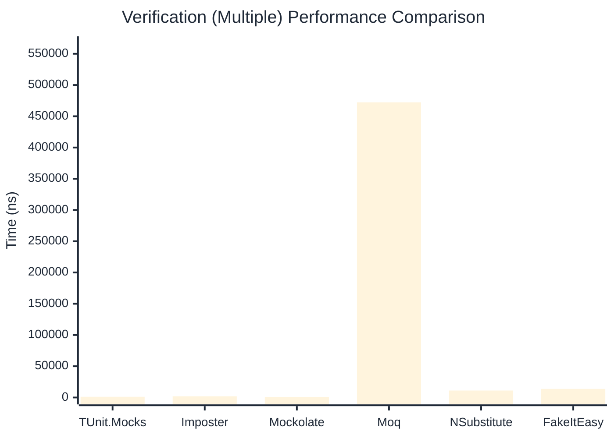

# Verification Benchmark

> Verifying mock method calls — comparing **TUnit.Mocks** (source-generated) against runtime proxy-based mocking libraries.

:::info Last Updated
This benchmark was automatically generated on **2026-08-04** from the latest CI run.

**Environment:** Ubuntu Latest • .NET SDK 10.0.302
:::

## 📊 Results

Verifying mock method calls:

| Library | Mean | Error | StdDev | Allocated |
|---------|------|-------|--------|-----------|
| **TUnit.Mocks** | 690.82 ns | 8.988 ns | 7.968 ns | 3008 B |
| Imposter | 702.99 ns | 9.738 ns | 8.633 ns | 4688 B |
| Mockolate | 407.07 ns | 7.319 ns | 6.847 ns | 2128 B |
| Moq | 341,411.08 ns | 4,016.656 ns | 3,560.661 ns | 24325 B |
| NSubstitute | 6,099.12 ns | 89.282 ns | 83.515 ns | 10064 B |
| FakeItEasy | 7,250.91 ns | 112.952 ns | 105.655 ns | 10722 B |

```mermaid
%%{init: {
  'theme':'base',
  'themeVariables': {
    'primaryColor': '#2563eb',
    'primaryTextColor': '#1f2937',
    'primaryBorderColor': '#1e40af',
    'lineColor': '#6b7280',
    'secondaryColor': '#7c3aed',
    'tertiaryColor': '#dc2626',
    'background': '#ffffff',
    'pie1': '#2563eb',
    'pie2': '#7c3aed',
    'pie3': '#dc2626',
    'pie4': '#f59e0b',
    'pie5': '#10b981',
    'pie6': '#06b6d4',
    'pie7': '#ec4899',
    'pie8': '#6366f1'
  }
}}%%
xychart-beta
  title "Verification Performance Comparison"
  x-axis ["TUnit.Mocks", "Imposter", "Mockolate", "Moq", "NSubstitute", "FakeItEasy"]
  y-axis "Time (ns)" 0 --> 409694
  bar [690.82, 702.99, 407.07, 341411.08, 6099.12, 7250.91]
```

---

### Never

| Library | Mean | Error | StdDev | Allocated |
|---------|------|-------|--------|-----------|
| **TUnit.Mocks** | 51.36 ns | 0.376 ns | 0.352 ns | 320 B |
| Imposter | 317.85 ns | 1.370 ns | 1.144 ns | 2400 B |
| Mockolate | 227.77 ns | 1.486 ns | 1.390 ns | 1144 B |
| Moq | 87,798.66 ns | 1,049.622 ns | 981.817 ns | 6918 B |
| NSubstitute | 3,531.71 ns | 20.887 ns | 19.538 ns | 7088 B |
| FakeItEasy | 3,505.37 ns | 21.257 ns | 19.884 ns | 5210 B |

```mermaid
%%{init: {
  'theme':'base',
  'themeVariables': {
    'primaryColor': '#2563eb',
    'primaryTextColor': '#1f2937',
    'primaryBorderColor': '#1e40af',
    'lineColor': '#6b7280',
    'secondaryColor': '#7c3aed',
    'tertiaryColor': '#dc2626',
    'background': '#ffffff',
    'pie1': '#2563eb',
    'pie2': '#7c3aed',
    'pie3': '#dc2626',
    'pie4': '#f59e0b',
    'pie5': '#10b981',
    'pie6': '#06b6d4',
    'pie7': '#ec4899',
    'pie8': '#6366f1'
  }
}}%%
xychart-beta
  title "Verification (Never) Performance Comparison"
  x-axis ["TUnit.Mocks", "Imposter", "Mockolate", "Moq", "NSubstitute", "FakeItEasy"]
  y-axis "Time (ns)" 0 --> 105359
  bar [51.36, 317.85, 227.77, 87798.66, 3531.71, 3505.37]
```

---

### Multiple

| Library | Mean | Error | StdDev | Allocated |
|---------|------|-------|--------|-----------|
| **TUnit.Mocks** | 1,225.61 ns | 7.678 ns | 7.182 ns | 4472 B |
| Imposter | 1,747.22 ns | 34.664 ns | 43.838 ns | 11192 B |
| Mockolate | 1,074.39 ns | 13.190 ns | 11.692 ns | 5240 B |
| Moq | 472,300.66 ns | 2,016.946 ns | 1,886.653 ns | 34699 B |
| NSubstitute | 11,161.70 ns | 53.722 ns | 41.943 ns | 16762 B |
| FakeItEasy | 13,804.94 ns | 138.271 ns | 122.573 ns | 19393 B |

```mermaid
%%{init: {
  'theme':'base',
  'themeVariables': {
    'primaryColor': '#2563eb',
    'primaryTextColor': '#1f2937',
    'primaryBorderColor': '#1e40af',
    'lineColor': '#6b7280',
    'secondaryColor': '#7c3aed',
    'tertiaryColor': '#dc2626',
    'background': '#ffffff',
    'pie1': '#2563eb',
    'pie2': '#7c3aed',
    'pie3': '#dc2626',
    'pie4': '#f59e0b',
    'pie5': '#10b981',
    'pie6': '#06b6d4',
    'pie7': '#ec4899',
    'pie8': '#6366f1'
  }
}}%%
xychart-beta
  title "Verification (Multiple) Performance Comparison"
  x-axis ["TUnit.Mocks", "Imposter", "Mockolate", "Moq", "NSubstitute", "FakeItEasy"]
  y-axis "Time (ns)" 0 --> 566761
  bar [1225.61, 1747.22, 1074.39, 472300.66, 11161.7, 13804.94]
```

## 🎯 Key Insights

This benchmark compares **TUnit.Mocks** (source-generated) against runtime proxy-based mocking libraries for verifying mock method calls.

---

:::note Methodology
View the [mock benchmarks overview](/docs/benchmarks/mocks) for methodology details and environment information.
:::

*Last generated: 2026-08-04T03:21:55.003Z*
