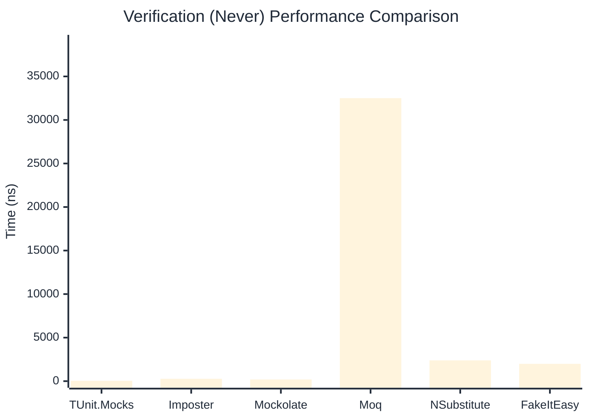

# Verification Benchmark

> Verifying mock method calls — comparing **TUnit.Mocks** (source-generated) against runtime proxy-based mocking libraries.

:::info Last Updated
This benchmark was automatically generated on **2026-09-13** from the latest CI run.

**Environment:** Ubuntu Latest • .NET SDK 10.0.401
:::

## 📊 Results

Verifying mock method calls:

| Library | Mean | Error | StdDev | Allocated |
|---------|------|-------|--------|-----------|
| **TUnit.Mocks** | 560.25 ns | 10.971 ns | 24.310 ns | 3008 B |
| Imposter | 557.45 ns | 11.078 ns | 18.812 ns | 4688 B |
| Mockolate | 334.19 ns | 6.682 ns | 13.649 ns | 2128 B |
| Moq | 129,938.52 ns | 893.386 ns | 791.964 ns | 24338 B |
| NSubstitute | 5,127.77 ns | 51.123 ns | 45.319 ns | 10064 B |
| FakeItEasy | 4,166.58 ns | 82.873 ns | 149.437 ns | 10717 B |

```mermaid
%%{init: {
  'theme':'base',
  'themeVariables': {
    'primaryColor': '#2563eb',
    'primaryTextColor': '#1f2937',
    'primaryBorderColor': '#1e40af',
    'lineColor': '#6b7280',
    'secondaryColor': '#7c3aed',
    'tertiaryColor': '#dc2626',
    'background': '#ffffff',
    'pie1': '#2563eb',
    'pie2': '#7c3aed',
    'pie3': '#dc2626',
    'pie4': '#f59e0b',
    'pie5': '#10b981',
    'pie6': '#06b6d4',
    'pie7': '#ec4899',
    'pie8': '#6366f1'
  }
}}%%
xychart-beta
  title "Verification Performance Comparison"
  x-axis ["TUnit.Mocks", "Imposter", "Mockolate", "Moq", "NSubstitute", "FakeItEasy"]
  y-axis "Time (ns)" 0 --> 155927
  bar [560.25, 557.45, 334.19, 129938.52, 5127.77, 4166.58]
```

---

### Never

| Library | Mean | Error | StdDev | Allocated |
|---------|------|-------|--------|-----------|
| **TUnit.Mocks** | 41.07 ns | 0.837 ns | 1.487 ns | 320 B |
| Imposter | 273.51 ns | 5.363 ns | 6.176 ns | 2400 B |
| Mockolate | 191.15 ns | 3.715 ns | 8.386 ns | 1144 B |
| Moq | 32,506.73 ns | 132.953 ns | 124.364 ns | 6922 B |
| NSubstitute | 2,385.96 ns | 38.541 ns | 37.853 ns | 7088 B |
| FakeItEasy | 1,987.85 ns | 37.856 ns | 42.077 ns | 5209 B |

```mermaid
%%{init: {
  'theme':'base',
  'themeVariables': {
    'primaryColor': '#2563eb',
    'primaryTextColor': '#1f2937',
    'primaryBorderColor': '#1e40af',
    'lineColor': '#6b7280',
    'secondaryColor': '#7c3aed',
    'tertiaryColor': '#dc2626',
    'background': '#ffffff',
    'pie1': '#2563eb',
    'pie2': '#7c3aed',
    'pie3': '#dc2626',
    'pie4': '#f59e0b',
    'pie5': '#10b981',
    'pie6': '#06b6d4',
    'pie7': '#ec4899',
    'pie8': '#6366f1'
  }
}}%%
xychart-beta
  title "Verification (Never) Performance Comparison"
  x-axis ["TUnit.Mocks", "Imposter", "Mockolate", "Moq", "NSubstitute", "FakeItEasy"]
  y-axis "Time (ns)" 0 --> 39009
  bar [41.07, 273.51, 191.15, 32506.73, 2385.96, 1987.85]
```

---

### Multiple

| Library | Mean | Error | StdDev | Allocated |
|---------|------|-------|--------|-----------|
| **TUnit.Mocks** | 952.87 ns | 16.389 ns | 20.127 ns | 4472 B |
| Imposter | 1,350.99 ns | 25.966 ns | 28.861 ns | 11192 B |
| Mockolate | 798.39 ns | 14.958 ns | 13.260 ns | 5240 B |
| Moq | 160,453.04 ns | 1,083.890 ns | 1,446.962 ns | 34696 B |
| NSubstitute | 8,266.55 ns | 164.642 ns | 154.006 ns | 16761 B |
| FakeItEasy | 7,689.27 ns | 118.713 ns | 105.236 ns | 19238 B |

```mermaid
%%{init: {
  'theme':'base',
  'themeVariables': {
    'primaryColor': '#2563eb',
    'primaryTextColor': '#1f2937',
    'primaryBorderColor': '#1e40af',
    'lineColor': '#6b7280',
    'secondaryColor': '#7c3aed',
    'tertiaryColor': '#dc2626',
    'background': '#ffffff',
    'pie1': '#2563eb',
    'pie2': '#7c3aed',
    'pie3': '#dc2626',
    'pie4': '#f59e0b',
    'pie5': '#10b981',
    'pie6': '#06b6d4',
    'pie7': '#ec4899',
    'pie8': '#6366f1'
  }
}}%%
xychart-beta
  title "Verification (Multiple) Performance Comparison"
  x-axis ["TUnit.Mocks", "Imposter", "Mockolate", "Moq", "NSubstitute", "FakeItEasy"]
  y-axis "Time (ns)" 0 --> 192544
  bar [952.87, 1350.99, 798.39, 160453.04, 8266.55, 7689.27]
```

## 🎯 Key Insights

This benchmark compares **TUnit.Mocks** (source-generated) against runtime proxy-based mocking libraries for verifying mock method calls.

---

:::note Methodology
View the [mock benchmarks overview](/docs/benchmarks/mocks) for methodology details and environment information.
:::

*Last generated: 2026-09-13T02:33:28.296Z*
