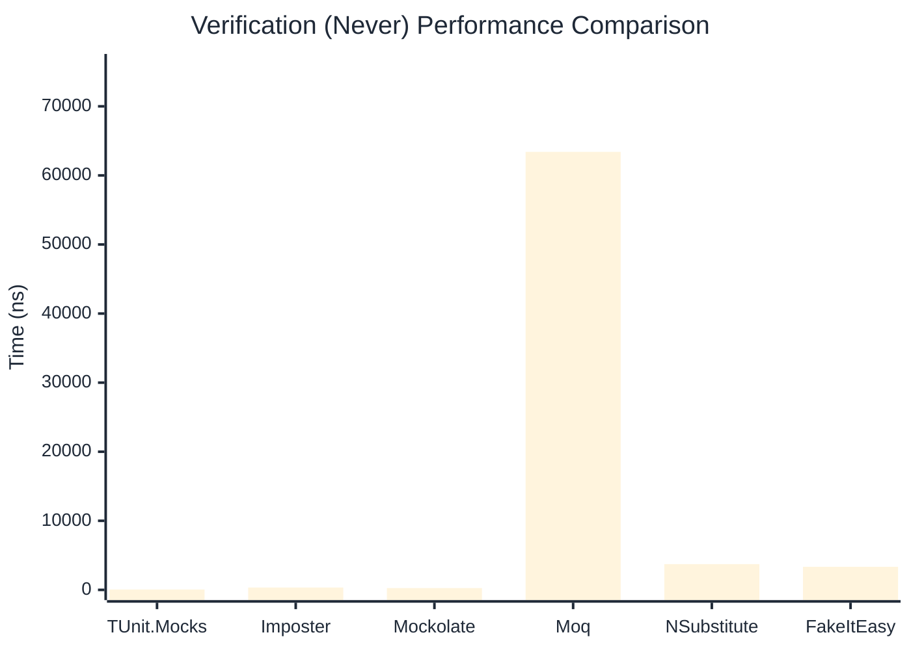

# Verification Benchmark

> Verifying mock method calls — comparing **TUnit.Mocks** (source-generated) against runtime proxy-based mocking libraries.

:::info Last Updated
This benchmark was automatically generated on **2026-08-15** from the latest CI run.

**Environment:** Ubuntu Latest • .NET SDK 10.0.400
:::

## 📊 Results

Verifying mock method calls:

| Library | Mean | Error | StdDev | Allocated |
|---------|------|-------|--------|-----------|
| **TUnit.Mocks** | 770.11 ns | 9.209 ns | 8.163 ns | 3008 B |
| Imposter | 709.62 ns | 10.292 ns | 9.627 ns | 4688 B |
| Mockolate | 404.48 ns | 1.726 ns | 1.615 ns | 2128 B |
| Moq | 247,371.52 ns | 951.480 ns | 794.529 ns | 24324 B |
| NSubstitute | 6,795.07 ns | 62.466 ns | 58.431 ns | 10064 B |
| FakeItEasy | 6,673.16 ns | 48.957 ns | 45.794 ns | 10722 B |

```mermaid
%%{init: {
  'theme':'base',
  'themeVariables': {
    'primaryColor': '#2563eb',
    'primaryTextColor': '#1f2937',
    'primaryBorderColor': '#1e40af',
    'lineColor': '#6b7280',
    'secondaryColor': '#7c3aed',
    'tertiaryColor': '#dc2626',
    'background': '#ffffff',
    'pie1': '#2563eb',
    'pie2': '#7c3aed',
    'pie3': '#dc2626',
    'pie4': '#f59e0b',
    'pie5': '#10b981',
    'pie6': '#06b6d4',
    'pie7': '#ec4899',
    'pie8': '#6366f1'
  }
}}%%
xychart-beta
  title "Verification Performance Comparison"
  x-axis ["TUnit.Mocks", "Imposter", "Mockolate", "Moq", "NSubstitute", "FakeItEasy"]
  y-axis "Time (ns)" 0 --> 296846
  bar [770.11, 709.62, 404.48, 247371.52, 6795.07, 6673.16]
```

---

### Never

| Library | Mean | Error | StdDev | Allocated |
|---------|------|-------|--------|-----------|
| **TUnit.Mocks** | 56.32 ns | 0.328 ns | 0.290 ns | 320 B |
| Imposter | 340.51 ns | 1.427 ns | 1.335 ns | 2400 B |
| Mockolate | 262.81 ns | 2.807 ns | 2.488 ns | 1144 B |
| Moq | 63,407.47 ns | 491.863 ns | 436.024 ns | 6925 B |
| NSubstitute | 3,728.92 ns | 37.220 ns | 34.816 ns | 7088 B |
| FakeItEasy | 3,342.84 ns | 19.467 ns | 18.209 ns | 5210 B |

```mermaid
%%{init: {
  'theme':'base',
  'themeVariables': {
    'primaryColor': '#2563eb',
    'primaryTextColor': '#1f2937',
    'primaryBorderColor': '#1e40af',
    'lineColor': '#6b7280',
    'secondaryColor': '#7c3aed',
    'tertiaryColor': '#dc2626',
    'background': '#ffffff',
    'pie1': '#2563eb',
    'pie2': '#7c3aed',
    'pie3': '#dc2626',
    'pie4': '#f59e0b',
    'pie5': '#10b981',
    'pie6': '#06b6d4',
    'pie7': '#ec4899',
    'pie8': '#6366f1'
  }
}}%%
xychart-beta
  title "Verification (Never) Performance Comparison"
  x-axis ["TUnit.Mocks", "Imposter", "Mockolate", "Moq", "NSubstitute", "FakeItEasy"]
  y-axis "Time (ns)" 0 --> 76089
  bar [56.32, 340.51, 262.81, 63407.47, 3728.92, 3342.84]
```

---

### Multiple

| Library | Mean | Error | StdDev | Allocated |
|---------|------|-------|--------|-----------|
| **TUnit.Mocks** | 1,338.08 ns | 3.847 ns | 3.410 ns | 4472 B |
| Imposter | 1,849.83 ns | 20.968 ns | 19.613 ns | 11192 B |
| Mockolate | 1,186.70 ns | 4.900 ns | 4.583 ns | 5240 B |
| Moq | 357,387.00 ns | 2,886.793 ns | 2,559.067 ns | 34811 B |
| NSubstitute | 11,869.64 ns | 31.251 ns | 29.232 ns | 16762 B |
| FakeItEasy | 12,247.61 ns | 111.519 ns | 98.858 ns | 19456 B |

```mermaid
%%{init: {
  'theme':'base',
  'themeVariables': {
    'primaryColor': '#2563eb',
    'primaryTextColor': '#1f2937',
    'primaryBorderColor': '#1e40af',
    'lineColor': '#6b7280',
    'secondaryColor': '#7c3aed',
    'tertiaryColor': '#dc2626',
    'background': '#ffffff',
    'pie1': '#2563eb',
    'pie2': '#7c3aed',
    'pie3': '#dc2626',
    'pie4': '#f59e0b',
    'pie5': '#10b981',
    'pie6': '#06b6d4',
    'pie7': '#ec4899',
    'pie8': '#6366f1'
  }
}}%%
xychart-beta
  title "Verification (Multiple) Performance Comparison"
  x-axis ["TUnit.Mocks", "Imposter", "Mockolate", "Moq", "NSubstitute", "FakeItEasy"]
  y-axis "Time (ns)" 0 --> 428865
  bar [1338.08, 1849.83, 1186.7, 357387, 11869.64, 12247.61]
```

## 🎯 Key Insights

This benchmark compares **TUnit.Mocks** (source-generated) against runtime proxy-based mocking libraries for verifying mock method calls.

---

:::note Methodology
View the [mock benchmarks overview](/docs/benchmarks/mocks) for methodology details and environment information.
:::

*Last generated: 2026-08-15T02:39:16.112Z*
