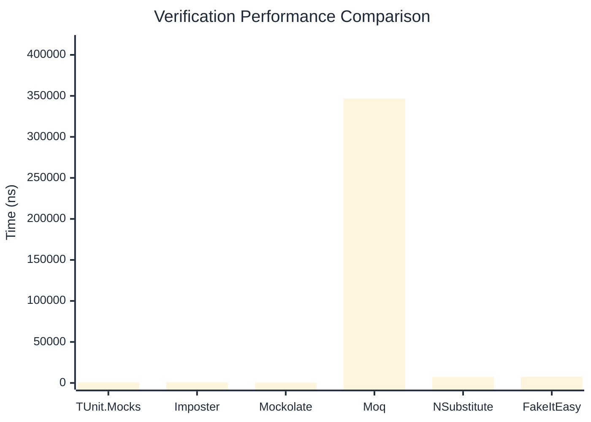

# Verification Benchmark

> Verifying mock method calls — comparing **TUnit.Mocks** (source-generated) against runtime proxy-based mocking libraries.

:::info Last Updated
This benchmark was automatically generated on **2026-09-21** from the latest CI run.

**Environment:** Ubuntu Latest • .NET SDK 10.0.401
:::

## 📊 Results

Verifying mock method calls:

| Library | Mean | Error | StdDev | Allocated |
|---------|------|-------|--------|-----------|
| **TUnit.Mocks** | 712.40 ns | 4.861 ns | 4.309 ns | 3008 B |
| Imposter | 842.11 ns | 10.410 ns | 9.737 ns | 4688 B |
| Mockolate | 453.26 ns | 4.011 ns | 3.349 ns | 2128 B |
| Moq | 346,685.21 ns | 1,434.223 ns | 1,119.747 ns | 24548 B |
| NSubstitute | 7,202.64 ns | 41.423 ns | 36.721 ns | 10064 B |
| FakeItEasy | 7,593.69 ns | 38.657 ns | 36.160 ns | 10722 B |

```mermaid
%%{init: {
  'theme':'base',
  'themeVariables': {
    'primaryColor': '#2563eb',
    'primaryTextColor': '#1f2937',
    'primaryBorderColor': '#1e40af',
    'lineColor': '#6b7280',
    'secondaryColor': '#7c3aed',
    'tertiaryColor': '#dc2626',
    'background': '#ffffff',
    'pie1': '#2563eb',
    'pie2': '#7c3aed',
    'pie3': '#dc2626',
    'pie4': '#f59e0b',
    'pie5': '#10b981',
    'pie6': '#06b6d4',
    'pie7': '#ec4899',
    'pie8': '#6366f1'
  }
}}%%
xychart-beta
  title "Verification Performance Comparison"
  x-axis ["TUnit.Mocks", "Imposter", "Mockolate", "Moq", "NSubstitute", "FakeItEasy"]
  y-axis "Time (ns)" 0 --> 416023
  bar [712.4, 842.11, 453.26, 346685.21, 7202.64, 7593.69]
```

---

### Never

| Library | Mean | Error | StdDev | Allocated |
|---------|------|-------|--------|-----------|
| **TUnit.Mocks** | 59.27 ns | 0.369 ns | 0.345 ns | 320 B |
| Imposter | 375.63 ns | 2.852 ns | 2.529 ns | 2400 B |
| Mockolate | 266.06 ns | 1.491 ns | 1.394 ns | 1144 B |
| Moq | 89,324.02 ns | 534.472 ns | 473.796 ns | 6918 B |
| NSubstitute | 4,056.30 ns | 34.456 ns | 32.230 ns | 7088 B |
| FakeItEasy | 3,938.06 ns | 27.526 ns | 24.401 ns | 5210 B |

```mermaid
%%{init: {
  'theme':'base',
  'themeVariables': {
    'primaryColor': '#2563eb',
    'primaryTextColor': '#1f2937',
    'primaryBorderColor': '#1e40af',
    'lineColor': '#6b7280',
    'secondaryColor': '#7c3aed',
    'tertiaryColor': '#dc2626',
    'background': '#ffffff',
    'pie1': '#2563eb',
    'pie2': '#7c3aed',
    'pie3': '#dc2626',
    'pie4': '#f59e0b',
    'pie5': '#10b981',
    'pie6': '#06b6d4',
    'pie7': '#ec4899',
    'pie8': '#6366f1'
  }
}}%%
xychart-beta
  title "Verification (Never) Performance Comparison"
  x-axis ["TUnit.Mocks", "Imposter", "Mockolate", "Moq", "NSubstitute", "FakeItEasy"]
  y-axis "Time (ns)" 0 --> 107189
  bar [59.27, 375.63, 266.06, 89324.02, 4056.3, 3938.06]
```

---

### Multiple

| Library | Mean | Error | StdDev | Allocated |
|---------|------|-------|--------|-----------|
| **TUnit.Mocks** | 1,377.30 ns | 10.105 ns | 9.452 ns | 4472 B |
| Imposter | 2,019.22 ns | 25.754 ns | 24.090 ns | 11192 B |
| Mockolate | 1,267.96 ns | 13.265 ns | 12.408 ns | 5240 B |
| Moq | 473,399.64 ns | 3,315.600 ns | 3,101.414 ns | 34699 B |
| NSubstitute | 12,844.55 ns | 48.286 ns | 40.321 ns | 16763 B |
| FakeItEasy | 13,945.43 ns | 190.230 ns | 168.634 ns | 19233 B |

```mermaid
%%{init: {
  'theme':'base',
  'themeVariables': {
    'primaryColor': '#2563eb',
    'primaryTextColor': '#1f2937',
    'primaryBorderColor': '#1e40af',
    'lineColor': '#6b7280',
    'secondaryColor': '#7c3aed',
    'tertiaryColor': '#dc2626',
    'background': '#ffffff',
    'pie1': '#2563eb',
    'pie2': '#7c3aed',
    'pie3': '#dc2626',
    'pie4': '#f59e0b',
    'pie5': '#10b981',
    'pie6': '#06b6d4',
    'pie7': '#ec4899',
    'pie8': '#6366f1'
  }
}}%%
xychart-beta
  title "Verification (Multiple) Performance Comparison"
  x-axis ["TUnit.Mocks", "Imposter", "Mockolate", "Moq", "NSubstitute", "FakeItEasy"]
  y-axis "Time (ns)" 0 --> 568080
  bar [1377.3, 2019.22, 1267.96, 473399.64, 12844.55, 13945.43]
```

## 🎯 Key Insights

This benchmark compares **TUnit.Mocks** (source-generated) against runtime proxy-based mocking libraries for verifying mock method calls.

---

:::note Methodology
View the [mock benchmarks overview](/docs/benchmarks/mocks) for methodology details and environment information.
:::

*Last generated: 2026-09-21T02:37:24.392Z*
