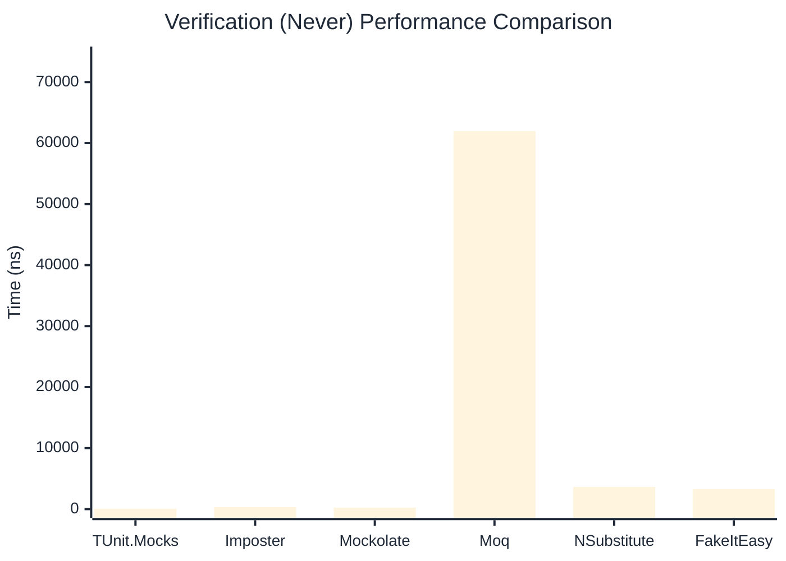

# Verification Benchmark

> Verifying mock method calls — comparing **TUnit.Mocks** (source-generated) against runtime proxy-based mocking libraries.

:::info Last Updated
This benchmark was automatically generated on **2026-09-03** from the latest CI run.

**Environment:** Ubuntu Latest • .NET SDK 10.0.400
:::

## 📊 Results

Verifying mock method calls:

| Library | Mean | Error | StdDev | Allocated |
|---------|------|-------|--------|-----------|
| **TUnit.Mocks** | 781.86 ns | 6.261 ns | 5.228 ns | 3008 B |
| Imposter | 695.69 ns | 10.457 ns | 9.782 ns | 4688 B |
| Mockolate | 410.35 ns | 5.057 ns | 4.731 ns | 2128 B |
| Moq | 242,949.91 ns | 2,014.815 ns | 1,884.660 ns | 24324 B |
| NSubstitute | 6,519.32 ns | 36.387 ns | 34.037 ns | 10064 B |
| FakeItEasy | 6,417.06 ns | 54.468 ns | 48.284 ns | 10722 B |

```mermaid
%%{init: {
  'theme':'base',
  'themeVariables': {
    'primaryColor': '#2563eb',
    'primaryTextColor': '#1f2937',
    'primaryBorderColor': '#1e40af',
    'lineColor': '#6b7280',
    'secondaryColor': '#7c3aed',
    'tertiaryColor': '#dc2626',
    'background': '#ffffff',
    'pie1': '#2563eb',
    'pie2': '#7c3aed',
    'pie3': '#dc2626',
    'pie4': '#f59e0b',
    'pie5': '#10b981',
    'pie6': '#06b6d4',
    'pie7': '#ec4899',
    'pie8': '#6366f1'
  }
}}%%
xychart-beta
  title "Verification Performance Comparison"
  x-axis ["TUnit.Mocks", "Imposter", "Mockolate", "Moq", "NSubstitute", "FakeItEasy"]
  y-axis "Time (ns)" 0 --> 291540
  bar [781.86, 695.69, 410.35, 242949.91, 6519.32, 6417.06]
```

---

### Never

| Library | Mean | Error | StdDev | Allocated |
|---------|------|-------|--------|-----------|
| **TUnit.Mocks** | 55.89 ns | 0.196 ns | 0.164 ns | 320 B |
| Imposter | 327.58 ns | 4.049 ns | 3.787 ns | 2400 B |
| Mockolate | 244.00 ns | 1.769 ns | 1.568 ns | 1144 B |
| Moq | 61,970.19 ns | 256.978 ns | 227.804 ns | 6925 B |
| NSubstitute | 3,645.79 ns | 24.804 ns | 21.988 ns | 7088 B |
| FakeItEasy | 3,282.43 ns | 34.024 ns | 30.161 ns | 5210 B |

```mermaid
%%{init: {
  'theme':'base',
  'themeVariables': {
    'primaryColor': '#2563eb',
    'primaryTextColor': '#1f2937',
    'primaryBorderColor': '#1e40af',
    'lineColor': '#6b7280',
    'secondaryColor': '#7c3aed',
    'tertiaryColor': '#dc2626',
    'background': '#ffffff',
    'pie1': '#2563eb',
    'pie2': '#7c3aed',
    'pie3': '#dc2626',
    'pie4': '#f59e0b',
    'pie5': '#10b981',
    'pie6': '#06b6d4',
    'pie7': '#ec4899',
    'pie8': '#6366f1'
  }
}}%%
xychart-beta
  title "Verification (Never) Performance Comparison"
  x-axis ["TUnit.Mocks", "Imposter", "Mockolate", "Moq", "NSubstitute", "FakeItEasy"]
  y-axis "Time (ns)" 0 --> 74365
  bar [55.89, 327.58, 244, 61970.19, 3645.79, 3282.43]
```

---

### Multiple

| Library | Mean | Error | StdDev | Allocated |
|---------|------|-------|--------|-----------|
| **TUnit.Mocks** | 1,290.53 ns | 13.490 ns | 12.619 ns | 4472 B |
| Imposter | 1,707.52 ns | 12.782 ns | 11.331 ns | 11192 B |
| Mockolate | 1,095.07 ns | 19.568 ns | 20.938 ns | 5240 B |
| Moq | 351,816.83 ns | 1,511.118 ns | 1,179.782 ns | 34699 B |
| NSubstitute | 11,635.22 ns | 101.948 ns | 95.362 ns | 16890 B |
| FakeItEasy | 12,142.22 ns | 239.597 ns | 246.049 ns | 19232 B |

```mermaid
%%{init: {
  'theme':'base',
  'themeVariables': {
    'primaryColor': '#2563eb',
    'primaryTextColor': '#1f2937',
    'primaryBorderColor': '#1e40af',
    'lineColor': '#6b7280',
    'secondaryColor': '#7c3aed',
    'tertiaryColor': '#dc2626',
    'background': '#ffffff',
    'pie1': '#2563eb',
    'pie2': '#7c3aed',
    'pie3': '#dc2626',
    'pie4': '#f59e0b',
    'pie5': '#10b981',
    'pie6': '#06b6d4',
    'pie7': '#ec4899',
    'pie8': '#6366f1'
  }
}}%%
xychart-beta
  title "Verification (Multiple) Performance Comparison"
  x-axis ["TUnit.Mocks", "Imposter", "Mockolate", "Moq", "NSubstitute", "FakeItEasy"]
  y-axis "Time (ns)" 0 --> 422181
  bar [1290.53, 1707.52, 1095.07, 351816.83, 11635.22, 12142.22]
```

## 🎯 Key Insights

This benchmark compares **TUnit.Mocks** (source-generated) against runtime proxy-based mocking libraries for verifying mock method calls.

---

:::note Methodology
View the [mock benchmarks overview](/docs/benchmarks/mocks) for methodology details and environment information.
:::

*Last generated: 2026-09-03T02:45:05.205Z*
