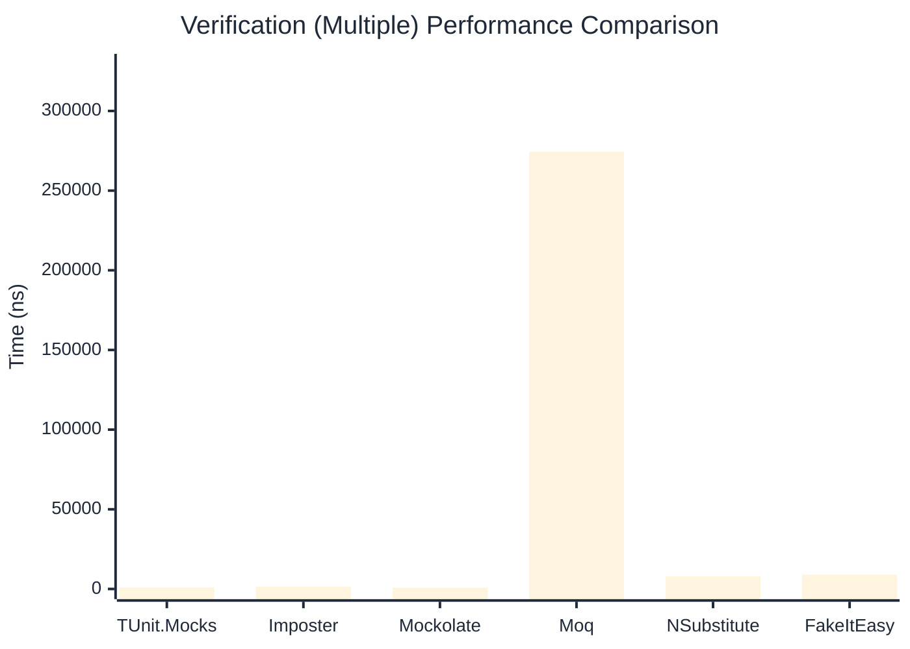

# Verification Benchmark

> Verifying mock method calls — comparing **TUnit.Mocks** (source-generated) against runtime proxy-based mocking libraries.

:::info Last Updated
This benchmark was automatically generated on **2026-08-08** from the latest CI run.

**Environment:** Ubuntu Latest • .NET SDK 10.0.302
:::

## 📊 Results

Verifying mock method calls:

| Library | Mean | Error | StdDev | Allocated |
|---------|------|-------|--------|-----------|
| **TUnit.Mocks** | 572.48 ns | 1.760 ns | 1.470 ns | 3008 B |
| Imposter | 526.78 ns | 2.156 ns | 1.911 ns | 4688 B |
| Mockolate | 305.86 ns | 0.614 ns | 0.544 ns | 2128 B |
| Moq | 190,694.43 ns | 1,162.150 ns | 1,030.216 ns | 24324 B |
| NSubstitute | 4,440.29 ns | 23.511 ns | 20.842 ns | 10064 B |
| FakeItEasy | 5,114.93 ns | 29.379 ns | 26.044 ns | 10722 B |

```mermaid
%%{init: {
  'theme':'base',
  'themeVariables': {
    'primaryColor': '#2563eb',
    'primaryTextColor': '#1f2937',
    'primaryBorderColor': '#1e40af',
    'lineColor': '#6b7280',
    'secondaryColor': '#7c3aed',
    'tertiaryColor': '#dc2626',
    'background': '#ffffff',
    'pie1': '#2563eb',
    'pie2': '#7c3aed',
    'pie3': '#dc2626',
    'pie4': '#f59e0b',
    'pie5': '#10b981',
    'pie6': '#06b6d4',
    'pie7': '#ec4899',
    'pie8': '#6366f1'
  }
}}%%
xychart-beta
  title "Verification Performance Comparison"
  x-axis ["TUnit.Mocks", "Imposter", "Mockolate", "Moq", "NSubstitute", "FakeItEasy"]
  y-axis "Time (ns)" 0 --> 228834
  bar [572.48, 526.78, 305.86, 190694.43, 4440.29, 5114.93]
```

---

### Never

| Library | Mean | Error | StdDev | Allocated |
|---------|------|-------|--------|-----------|
| **TUnit.Mocks** | 42.41 ns | 0.097 ns | 0.086 ns | 320 B |
| Imposter | 257.31 ns | 4.418 ns | 4.132 ns | 2400 B |
| Mockolate | 195.94 ns | 2.076 ns | 1.840 ns | 1144 B |
| Moq | 49,344.14 ns | 201.488 ns | 178.614 ns | 6925 B |
| NSubstitute | 2,618.94 ns | 12.484 ns | 11.067 ns | 7088 B |
| FakeItEasy | 2,523.83 ns | 9.448 ns | 8.376 ns | 5210 B |

```mermaid
%%{init: {
  'theme':'base',
  'themeVariables': {
    'primaryColor': '#2563eb',
    'primaryTextColor': '#1f2937',
    'primaryBorderColor': '#1e40af',
    'lineColor': '#6b7280',
    'secondaryColor': '#7c3aed',
    'tertiaryColor': '#dc2626',
    'background': '#ffffff',
    'pie1': '#2563eb',
    'pie2': '#7c3aed',
    'pie3': '#dc2626',
    'pie4': '#f59e0b',
    'pie5': '#10b981',
    'pie6': '#06b6d4',
    'pie7': '#ec4899',
    'pie8': '#6366f1'
  }
}}%%
xychart-beta
  title "Verification (Never) Performance Comparison"
  x-axis ["TUnit.Mocks", "Imposter", "Mockolate", "Moq", "NSubstitute", "FakeItEasy"]
  y-axis "Time (ns)" 0 --> 59213
  bar [42.41, 257.31, 195.94, 49344.14, 2618.94, 2523.83]
```

---

### Multiple

| Library | Mean | Error | StdDev | Allocated |
|---------|------|-------|--------|-----------|
| **TUnit.Mocks** | 977.60 ns | 3.398 ns | 3.179 ns | 4472 B |
| Imposter | 1,310.13 ns | 8.740 ns | 8.176 ns | 11192 B |
| Mockolate | 843.21 ns | 5.315 ns | 4.972 ns | 5240 B |
| Moq | 274,473.63 ns | 1,371.182 ns | 1,215.517 ns | 34842 B |
| NSubstitute | 7,921.79 ns | 45.596 ns | 40.420 ns | 16762 B |
| FakeItEasy | 8,981.93 ns | 75.203 ns | 70.345 ns | 19232 B |

```mermaid
%%{init: {
  'theme':'base',
  'themeVariables': {
    'primaryColor': '#2563eb',
    'primaryTextColor': '#1f2937',
    'primaryBorderColor': '#1e40af',
    'lineColor': '#6b7280',
    'secondaryColor': '#7c3aed',
    'tertiaryColor': '#dc2626',
    'background': '#ffffff',
    'pie1': '#2563eb',
    'pie2': '#7c3aed',
    'pie3': '#dc2626',
    'pie4': '#f59e0b',
    'pie5': '#10b981',
    'pie6': '#06b6d4',
    'pie7': '#ec4899',
    'pie8': '#6366f1'
  }
}}%%
xychart-beta
  title "Verification (Multiple) Performance Comparison"
  x-axis ["TUnit.Mocks", "Imposter", "Mockolate", "Moq", "NSubstitute", "FakeItEasy"]
  y-axis "Time (ns)" 0 --> 329369
  bar [977.6, 1310.13, 843.21, 274473.63, 7921.79, 8981.93]
```

## 🎯 Key Insights

This benchmark compares **TUnit.Mocks** (source-generated) against runtime proxy-based mocking libraries for verifying mock method calls.

---

:::note Methodology
View the [mock benchmarks overview](/docs/benchmarks/mocks) for methodology details and environment information.
:::

*Last generated: 2026-08-08T02:56:03.834Z*
