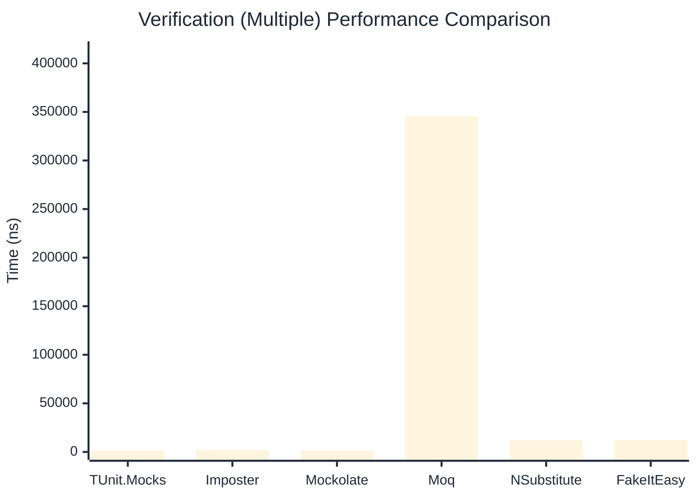

# Verification Benchmark

> Verifying mock method calls — comparing **TUnit.Mocks** (source-generated) against runtime proxy-based mocking libraries.

:::info Last Updated
This benchmark was automatically generated on **2026-08-20** from the latest CI run.

**Environment:** Ubuntu Latest • .NET SDK 10.0.400
:::

## 📊 Results

Verifying mock method calls:

| Library | Mean | Error | StdDev | Allocated |
|---------|------|-------|--------|-----------|
| **TUnit.Mocks** | 796.36 ns | 5.402 ns | 5.053 ns | 3008 B |
| Imposter | 794.44 ns | 10.779 ns | 10.083 ns | 4688 B |
| Mockolate | 405.51 ns | 2.064 ns | 1.829 ns | 2128 B |
| Moq | 241,062.02 ns | 1,476.713 ns | 1,309.068 ns | 24324 B |
| NSubstitute | 6,785.64 ns | 60.191 ns | 56.303 ns | 10064 B |
| FakeItEasy | 6,875.33 ns | 62.834 ns | 58.775 ns | 10722 B |

```mermaid
%%{init: {
  'theme':'base',
  'themeVariables': {
    'primaryColor': '#2563eb',
    'primaryTextColor': '#1f2937',
    'primaryBorderColor': '#1e40af',
    'lineColor': '#6b7280',
    'secondaryColor': '#7c3aed',
    'tertiaryColor': '#dc2626',
    'background': '#ffffff',
    'pie1': '#2563eb',
    'pie2': '#7c3aed',
    'pie3': '#dc2626',
    'pie4': '#f59e0b',
    'pie5': '#10b981',
    'pie6': '#06b6d4',
    'pie7': '#ec4899',
    'pie8': '#6366f1'
  }
}}%%
xychart-beta
  title "Verification Performance Comparison"
  x-axis ["TUnit.Mocks", "Imposter", "Mockolate", "Moq", "NSubstitute", "FakeItEasy"]
  y-axis "Time (ns)" 0 --> 289275
  bar [796.36, 794.44, 405.51, 241062.02, 6785.64, 6875.33]
```

---

### Never

| Library | Mean | Error | StdDev | Allocated |
|---------|------|-------|--------|-----------|
| **TUnit.Mocks** | 57.76 ns | 0.397 ns | 0.371 ns | 320 B |
| Imposter | 346.61 ns | 1.914 ns | 1.790 ns | 2400 B |
| Mockolate | 254.15 ns | 1.796 ns | 1.680 ns | 1144 B |
| Moq | 62,466.28 ns | 376.399 ns | 314.311 ns | 6925 B |
| NSubstitute | 3,925.45 ns | 33.338 ns | 27.839 ns | 7088 B |
| FakeItEasy | 3,497.77 ns | 51.773 ns | 45.896 ns | 5210 B |

```mermaid
%%{init: {
  'theme':'base',
  'themeVariables': {
    'primaryColor': '#2563eb',
    'primaryTextColor': '#1f2937',
    'primaryBorderColor': '#1e40af',
    'lineColor': '#6b7280',
    'secondaryColor': '#7c3aed',
    'tertiaryColor': '#dc2626',
    'background': '#ffffff',
    'pie1': '#2563eb',
    'pie2': '#7c3aed',
    'pie3': '#dc2626',
    'pie4': '#f59e0b',
    'pie5': '#10b981',
    'pie6': '#06b6d4',
    'pie7': '#ec4899',
    'pie8': '#6366f1'
  }
}}%%
xychart-beta
  title "Verification (Never) Performance Comparison"
  x-axis ["TUnit.Mocks", "Imposter", "Mockolate", "Moq", "NSubstitute", "FakeItEasy"]
  y-axis "Time (ns)" 0 --> 74960
  bar [57.76, 346.61, 254.15, 62466.28, 3925.45, 3497.77]
```

---

### Multiple

| Library | Mean | Error | StdDev | Allocated |
|---------|------|-------|--------|-----------|
| **TUnit.Mocks** | 1,338.64 ns | 5.865 ns | 5.486 ns | 4472 B |
| Imposter | 1,981.97 ns | 15.107 ns | 14.131 ns | 11192 B |
| Mockolate | 1,288.80 ns | 21.945 ns | 20.527 ns | 5240 B |
| Moq | 345,444.27 ns | 2,622.757 ns | 2,453.328 ns | 34699 B |
| NSubstitute | 12,012.73 ns | 37.866 ns | 33.567 ns | 16762 B |
| FakeItEasy | 12,404.93 ns | 84.950 ns | 79.462 ns | 19232 B |

```mermaid
%%{init: {
  'theme':'base',
  'themeVariables': {
    'primaryColor': '#2563eb',
    'primaryTextColor': '#1f2937',
    'primaryBorderColor': '#1e40af',
    'lineColor': '#6b7280',
    'secondaryColor': '#7c3aed',
    'tertiaryColor': '#dc2626',
    'background': '#ffffff',
    'pie1': '#2563eb',
    'pie2': '#7c3aed',
    'pie3': '#dc2626',
    'pie4': '#f59e0b',
    'pie5': '#10b981',
    'pie6': '#06b6d4',
    'pie7': '#ec4899',
    'pie8': '#6366f1'
  }
}}%%
xychart-beta
  title "Verification (Multiple) Performance Comparison"
  x-axis ["TUnit.Mocks", "Imposter", "Mockolate", "Moq", "NSubstitute", "FakeItEasy"]
  y-axis "Time (ns)" 0 --> 414534
  bar [1338.64, 1981.97, 1288.8, 345444.27, 12012.73, 12404.93]
```

## 🎯 Key Insights

This benchmark compares **TUnit.Mocks** (source-generated) against runtime proxy-based mocking libraries for verifying mock method calls.

---

:::note Methodology
View the [mock benchmarks overview](/docs/benchmarks/mocks) for methodology details and environment information.
:::

*Last generated: 2026-08-20T02:41:11.657Z*
