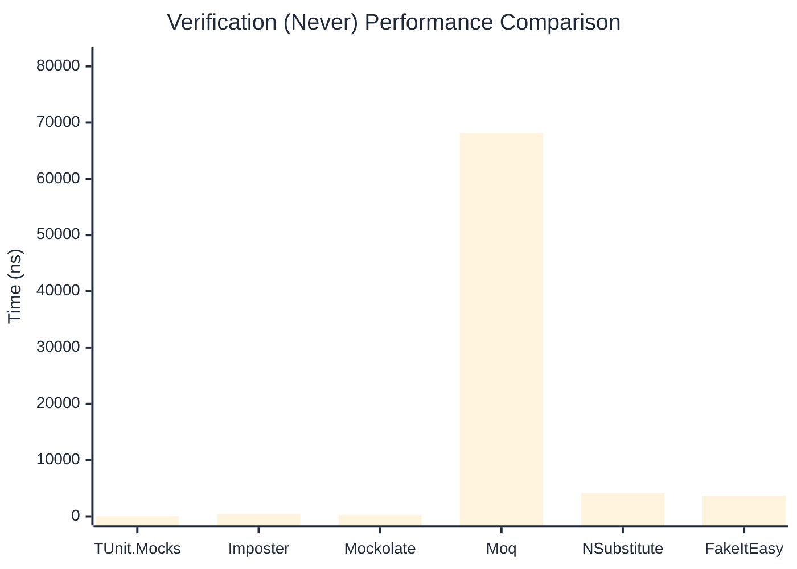

# Verification Benchmark

> Verifying mock method calls — comparing **TUnit.Mocks** (source-generated) against runtime proxy-based mocking libraries.

:::info Last Updated
This benchmark was automatically generated on **2026-08-12** from the latest CI run.

**Environment:** Ubuntu Latest • .NET SDK 10.0.400
:::

## 📊 Results

Verifying mock method calls:

| Library | Mean | Error | StdDev | Allocated |
|---------|------|-------|--------|-----------|
| **TUnit.Mocks** | 872.55 ns | 3.256 ns | 2.886 ns | 3008 B |
| Imposter | 793.00 ns | 4.467 ns | 3.960 ns | 4688 B |
| Mockolate | 477.32 ns | 4.470 ns | 3.733 ns | 2128 B |
| Moq | 282,429.79 ns | 2,640.849 ns | 2,470.252 ns | 24325 B |
| NSubstitute | 7,619.27 ns | 57.164 ns | 47.734 ns | 10064 B |
| FakeItEasy | 7,570.53 ns | 60.968 ns | 57.029 ns | 10722 B |

```mermaid
%%{init: {
  'theme':'base',
  'themeVariables': {
    'primaryColor': '#2563eb',
    'primaryTextColor': '#1f2937',
    'primaryBorderColor': '#1e40af',
    'lineColor': '#6b7280',
    'secondaryColor': '#7c3aed',
    'tertiaryColor': '#dc2626',
    'background': '#ffffff',
    'pie1': '#2563eb',
    'pie2': '#7c3aed',
    'pie3': '#dc2626',
    'pie4': '#f59e0b',
    'pie5': '#10b981',
    'pie6': '#06b6d4',
    'pie7': '#ec4899',
    'pie8': '#6366f1'
  }
}}%%
xychart-beta
  title "Verification Performance Comparison"
  x-axis ["TUnit.Mocks", "Imposter", "Mockolate", "Moq", "NSubstitute", "FakeItEasy"]
  y-axis "Time (ns)" 0 --> 338916
  bar [872.55, 793, 477.32, 282429.79, 7619.27, 7570.53]
```

---

### Never

| Library | Mean | Error | StdDev | Allocated |
|---------|------|-------|--------|-----------|
| **TUnit.Mocks** | 64.53 ns | 0.168 ns | 0.140 ns | 320 B |
| Imposter | 376.67 ns | 1.866 ns | 1.654 ns | 2400 B |
| Mockolate | 278.98 ns | 1.414 ns | 1.323 ns | 1144 B |
| Moq | 68,160.06 ns | 374.021 ns | 331.560 ns | 6918 B |
| NSubstitute | 4,178.41 ns | 19.547 ns | 18.284 ns | 7088 B |
| FakeItEasy | 3,691.91 ns | 19.242 ns | 17.057 ns | 5210 B |

```mermaid
%%{init: {
  'theme':'base',
  'themeVariables': {
    'primaryColor': '#2563eb',
    'primaryTextColor': '#1f2937',
    'primaryBorderColor': '#1e40af',
    'lineColor': '#6b7280',
    'secondaryColor': '#7c3aed',
    'tertiaryColor': '#dc2626',
    'background': '#ffffff',
    'pie1': '#2563eb',
    'pie2': '#7c3aed',
    'pie3': '#dc2626',
    'pie4': '#f59e0b',
    'pie5': '#10b981',
    'pie6': '#06b6d4',
    'pie7': '#ec4899',
    'pie8': '#6366f1'
  }
}}%%
xychart-beta
  title "Verification (Never) Performance Comparison"
  x-axis ["TUnit.Mocks", "Imposter", "Mockolate", "Moq", "NSubstitute", "FakeItEasy"]
  y-axis "Time (ns)" 0 --> 81793
  bar [64.53, 376.67, 278.98, 68160.06, 4178.41, 3691.91]
```

---

### Multiple

| Library | Mean | Error | StdDev | Allocated |
|---------|------|-------|--------|-----------|
| **TUnit.Mocks** | 1,447.72 ns | 3.798 ns | 3.171 ns | 4472 B |
| Imposter | 1,999.59 ns | 12.060 ns | 10.691 ns | 11192 B |
| Mockolate | 1,240.36 ns | 7.516 ns | 6.663 ns | 5240 B |
| Moq | 388,432.96 ns | 2,238.523 ns | 1,869.268 ns | 34699 B |
| NSubstitute | 13,349.75 ns | 134.284 ns | 119.039 ns | 16891 B |
| FakeItEasy | 13,419.80 ns | 159.295 ns | 133.019 ns | 19233 B |

```mermaid
%%{init: {
  'theme':'base',
  'themeVariables': {
    'primaryColor': '#2563eb',
    'primaryTextColor': '#1f2937',
    'primaryBorderColor': '#1e40af',
    'lineColor': '#6b7280',
    'secondaryColor': '#7c3aed',
    'tertiaryColor': '#dc2626',
    'background': '#ffffff',
    'pie1': '#2563eb',
    'pie2': '#7c3aed',
    'pie3': '#dc2626',
    'pie4': '#f59e0b',
    'pie5': '#10b981',
    'pie6': '#06b6d4',
    'pie7': '#ec4899',
    'pie8': '#6366f1'
  }
}}%%
xychart-beta
  title "Verification (Multiple) Performance Comparison"
  x-axis ["TUnit.Mocks", "Imposter", "Mockolate", "Moq", "NSubstitute", "FakeItEasy"]
  y-axis "Time (ns)" 0 --> 466120
  bar [1447.72, 1999.59, 1240.36, 388432.96, 13349.75, 13419.8]
```

## 🎯 Key Insights

This benchmark compares **TUnit.Mocks** (source-generated) against runtime proxy-based mocking libraries for verifying mock method calls.

---

:::note Methodology
View the [mock benchmarks overview](/docs/benchmarks/mocks) for methodology details and environment information.
:::

*Last generated: 2026-08-12T03:10:08.627Z*
