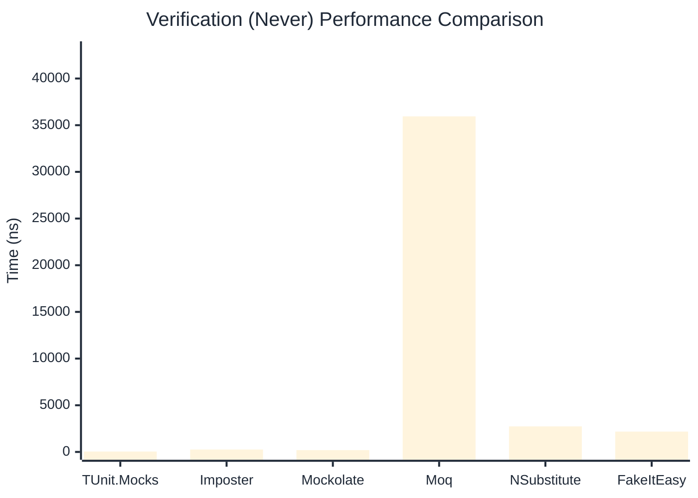

# Verification Benchmark

> Verifying mock method calls — comparing **TUnit.Mocks** (source-generated) against runtime proxy-based mocking libraries.

:::info Last Updated
This benchmark was automatically generated on **2026-09-18** from the latest CI run.

**Environment:** Ubuntu Latest • .NET SDK 10.0.401
:::

## 📊 Results

Verifying mock method calls:

| Library | Mean | Error | StdDev | Allocated |
|---------|------|-------|--------|-----------|
| **TUnit.Mocks** | 623.47 ns | 7.353 ns | 6.878 ns | 3008 B |
| Imposter | 571.24 ns | 2.821 ns | 2.501 ns | 4688 B |
| Mockolate | 361.88 ns | 0.633 ns | 0.592 ns | 2128 B |
| Moq | 148,083.90 ns | 501.597 ns | 444.653 ns | 24338 B |
| NSubstitute | 5,536.94 ns | 41.500 ns | 36.789 ns | 10176 B |
| FakeItEasy | 4,603.43 ns | 35.836 ns | 31.767 ns | 10961 B |

```mermaid
%%{init: {
  'theme':'base',
  'themeVariables': {
    'primaryColor': '#2563eb',
    'primaryTextColor': '#1f2937',
    'primaryBorderColor': '#1e40af',
    'lineColor': '#6b7280',
    'secondaryColor': '#7c3aed',
    'tertiaryColor': '#dc2626',
    'background': '#ffffff',
    'pie1': '#2563eb',
    'pie2': '#7c3aed',
    'pie3': '#dc2626',
    'pie4': '#f59e0b',
    'pie5': '#10b981',
    'pie6': '#06b6d4',
    'pie7': '#ec4899',
    'pie8': '#6366f1'
  }
}}%%
xychart-beta
  title "Verification Performance Comparison"
  x-axis ["TUnit.Mocks", "Imposter", "Mockolate", "Moq", "NSubstitute", "FakeItEasy"]
  y-axis "Time (ns)" 0 --> 177701
  bar [623.47, 571.24, 361.88, 148083.9, 5536.94, 4603.43]
```

---

### Never

| Library | Mean | Error | StdDev | Allocated |
|---------|------|-------|--------|-----------|
| **TUnit.Mocks** | 43.61 ns | 0.114 ns | 0.095 ns | 320 B |
| Imposter | 260.35 ns | 0.498 ns | 0.416 ns | 2400 B |
| Mockolate | 197.09 ns | 0.229 ns | 0.214 ns | 1144 B |
| Moq | 35,946.07 ns | 119.364 ns | 105.813 ns | 6922 B |
| NSubstitute | 2,735.18 ns | 11.797 ns | 10.457 ns | 7088 B |
| FakeItEasy | 2,179.94 ns | 9.919 ns | 8.793 ns | 5205 B |

```mermaid
%%{init: {
  'theme':'base',
  'themeVariables': {
    'primaryColor': '#2563eb',
    'primaryTextColor': '#1f2937',
    'primaryBorderColor': '#1e40af',
    'lineColor': '#6b7280',
    'secondaryColor': '#7c3aed',
    'tertiaryColor': '#dc2626',
    'background': '#ffffff',
    'pie1': '#2563eb',
    'pie2': '#7c3aed',
    'pie3': '#dc2626',
    'pie4': '#f59e0b',
    'pie5': '#10b981',
    'pie6': '#06b6d4',
    'pie7': '#ec4899',
    'pie8': '#6366f1'
  }
}}%%
xychart-beta
  title "Verification (Never) Performance Comparison"
  x-axis ["TUnit.Mocks", "Imposter", "Mockolate", "Moq", "NSubstitute", "FakeItEasy"]
  y-axis "Time (ns)" 0 --> 43136
  bar [43.61, 260.35, 197.09, 35946.07, 2735.18, 2179.94]
```

---

### Multiple

| Library | Mean | Error | StdDev | Allocated |
|---------|------|-------|--------|-----------|
| **TUnit.Mocks** | 1,180.57 ns | 2.119 ns | 1.878 ns | 4472 B |
| Imposter | 1,335.44 ns | 1.363 ns | 1.275 ns | 11192 B |
| Mockolate | 882.56 ns | 0.924 ns | 0.819 ns | 5240 B |
| Moq | 186,646.44 ns | 920.381 ns | 815.894 ns | 34584 B |
| NSubstitute | 9,139.52 ns | 22.984 ns | 19.193 ns | 16761 B |
| FakeItEasy | 8,031.93 ns | 45.711 ns | 35.688 ns | 19238 B |

```mermaid
%%{init: {
  'theme':'base',
  'themeVariables': {
    'primaryColor': '#2563eb',
    'primaryTextColor': '#1f2937',
    'primaryBorderColor': '#1e40af',
    'lineColor': '#6b7280',
    'secondaryColor': '#7c3aed',
    'tertiaryColor': '#dc2626',
    'background': '#ffffff',
    'pie1': '#2563eb',
    'pie2': '#7c3aed',
    'pie3': '#dc2626',
    'pie4': '#f59e0b',
    'pie5': '#10b981',
    'pie6': '#06b6d4',
    'pie7': '#ec4899',
    'pie8': '#6366f1'
  }
}}%%
xychart-beta
  title "Verification (Multiple) Performance Comparison"
  x-axis ["TUnit.Mocks", "Imposter", "Mockolate", "Moq", "NSubstitute", "FakeItEasy"]
  y-axis "Time (ns)" 0 --> 223976
  bar [1180.57, 1335.44, 882.56, 186646.44, 9139.52, 8031.93]
```

## 🎯 Key Insights

This benchmark compares **TUnit.Mocks** (source-generated) against runtime proxy-based mocking libraries for verifying mock method calls.

---

:::note Methodology
View the [mock benchmarks overview](/docs/benchmarks/mocks) for methodology details and environment information.
:::

*Last generated: 2026-09-18T02:32:22.133Z*
