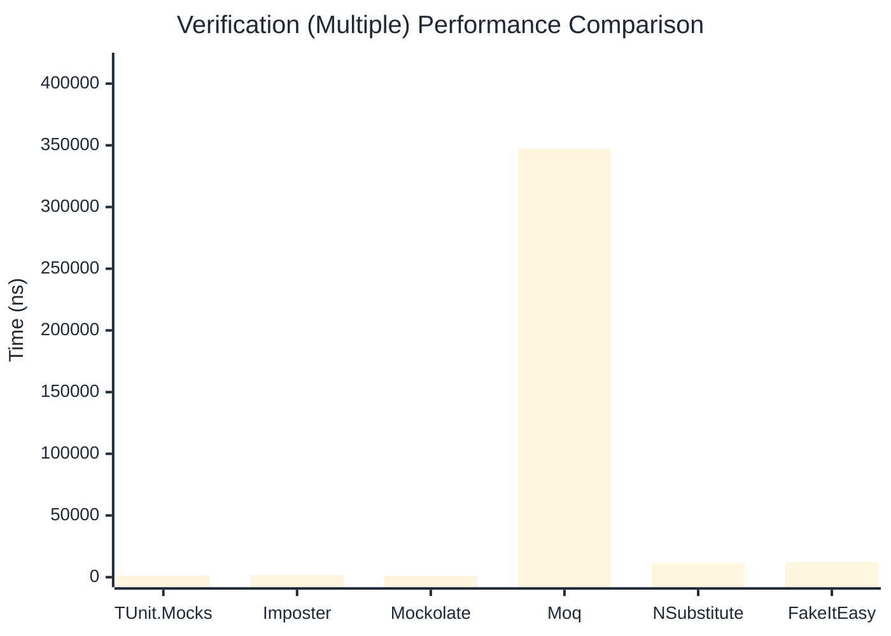

# Verification Benchmark

> Verifying mock method calls — comparing **TUnit.Mocks** (source-generated) against runtime proxy-based mocking libraries.

:::info Last Updated
This benchmark was automatically generated on **2026-09-27** from the latest CI run.

**Environment:** Ubuntu Latest • .NET SDK 10.0.401
:::

## 📊 Results

Verifying mock method calls:

| Library | Mean | Error | StdDev | Allocated |
|---------|------|-------|--------|-----------|
| **TUnit.Mocks** | 736.27 ns | 6.110 ns | 5.715 ns | 3008 B |
| Imposter | 676.74 ns | 3.401 ns | 3.181 ns | 4688 B |
| Mockolate | 398.05 ns | 1.672 ns | 1.483 ns | 2128 B |
| Moq | 237,988.85 ns | 1,730.571 ns | 1,534.106 ns | 24324 B |
| NSubstitute | 6,424.63 ns | 22.868 ns | 21.391 ns | 10064 B |
| FakeItEasy | 6,330.79 ns | 16.146 ns | 14.313 ns | 10722 B |

```mermaid
%%{init: {
  'theme':'base',
  'themeVariables': {
    'primaryColor': '#2563eb',
    'primaryTextColor': '#1f2937',
    'primaryBorderColor': '#1e40af',
    'lineColor': '#6b7280',
    'secondaryColor': '#7c3aed',
    'tertiaryColor': '#dc2626',
    'background': '#ffffff',
    'pie1': '#2563eb',
    'pie2': '#7c3aed',
    'pie3': '#dc2626',
    'pie4': '#f59e0b',
    'pie5': '#10b981',
    'pie6': '#06b6d4',
    'pie7': '#ec4899',
    'pie8': '#6366f1'
  }
}}%%
xychart-beta
  title "Verification Performance Comparison"
  x-axis ["TUnit.Mocks", "Imposter", "Mockolate", "Moq", "NSubstitute", "FakeItEasy"]
  y-axis "Time (ns)" 0 --> 285587
  bar [736.27, 676.74, 398.05, 237988.85, 6424.63, 6330.79]
```

---

### Never

| Library | Mean | Error | StdDev | Allocated |
|---------|------|-------|--------|-----------|
| **TUnit.Mocks** | 53.83 ns | 0.150 ns | 0.140 ns | 320 B |
| Imposter | 318.25 ns | 0.569 ns | 0.504 ns | 2400 B |
| Mockolate | 234.47 ns | 0.589 ns | 0.522 ns | 1144 B |
| Moq | 62,316.71 ns | 366.024 ns | 285.767 ns | 6925 B |
| NSubstitute | 3,532.67 ns | 8.859 ns | 8.287 ns | 7088 B |
| FakeItEasy | 3,184.47 ns | 13.833 ns | 12.939 ns | 5210 B |

```mermaid
%%{init: {
  'theme':'base',
  'themeVariables': {
    'primaryColor': '#2563eb',
    'primaryTextColor': '#1f2937',
    'primaryBorderColor': '#1e40af',
    'lineColor': '#6b7280',
    'secondaryColor': '#7c3aed',
    'tertiaryColor': '#dc2626',
    'background': '#ffffff',
    'pie1': '#2563eb',
    'pie2': '#7c3aed',
    'pie3': '#dc2626',
    'pie4': '#f59e0b',
    'pie5': '#10b981',
    'pie6': '#06b6d4',
    'pie7': '#ec4899',
    'pie8': '#6366f1'
  }
}}%%
xychart-beta
  title "Verification (Never) Performance Comparison"
  x-axis ["TUnit.Mocks", "Imposter", "Mockolate", "Moq", "NSubstitute", "FakeItEasy"]
  y-axis "Time (ns)" 0 --> 74781
  bar [53.83, 318.25, 234.47, 62316.71, 3532.67, 3184.47]
```

---

### Multiple

| Library | Mean | Error | StdDev | Allocated |
|---------|------|-------|--------|-----------|
| **TUnit.Mocks** | 1,250.61 ns | 2.837 ns | 2.654 ns | 4472 B |
| Imposter | 1,650.72 ns | 5.101 ns | 4.522 ns | 11192 B |
| Mockolate | 1,046.23 ns | 4.805 ns | 4.494 ns | 5240 B |
| Moq | 347,352.06 ns | 2,834.234 ns | 2,512.475 ns | 34699 B |
| NSubstitute | 11,307.22 ns | 60.332 ns | 56.435 ns | 16762 B |
| FakeItEasy | 11,827.79 ns | 110.587 ns | 98.032 ns | 19456 B |

```mermaid
%%{init: {
  'theme':'base',
  'themeVariables': {
    'primaryColor': '#2563eb',
    'primaryTextColor': '#1f2937',
    'primaryBorderColor': '#1e40af',
    'lineColor': '#6b7280',
    'secondaryColor': '#7c3aed',
    'tertiaryColor': '#dc2626',
    'background': '#ffffff',
    'pie1': '#2563eb',
    'pie2': '#7c3aed',
    'pie3': '#dc2626',
    'pie4': '#f59e0b',
    'pie5': '#10b981',
    'pie6': '#06b6d4',
    'pie7': '#ec4899',
    'pie8': '#6366f1'
  }
}}%%
xychart-beta
  title "Verification (Multiple) Performance Comparison"
  x-axis ["TUnit.Mocks", "Imposter", "Mockolate", "Moq", "NSubstitute", "FakeItEasy"]
  y-axis "Time (ns)" 0 --> 416823
  bar [1250.61, 1650.72, 1046.23, 347352.06, 11307.22, 11827.79]
```

## 🎯 Key Insights

This benchmark compares **TUnit.Mocks** (source-generated) against runtime proxy-based mocking libraries for verifying mock method calls.

---

:::note Methodology
View the [mock benchmarks overview](/docs/benchmarks/mocks) for methodology details and environment information.
:::

*Last generated: 2026-09-27T02:37:02.890Z*
