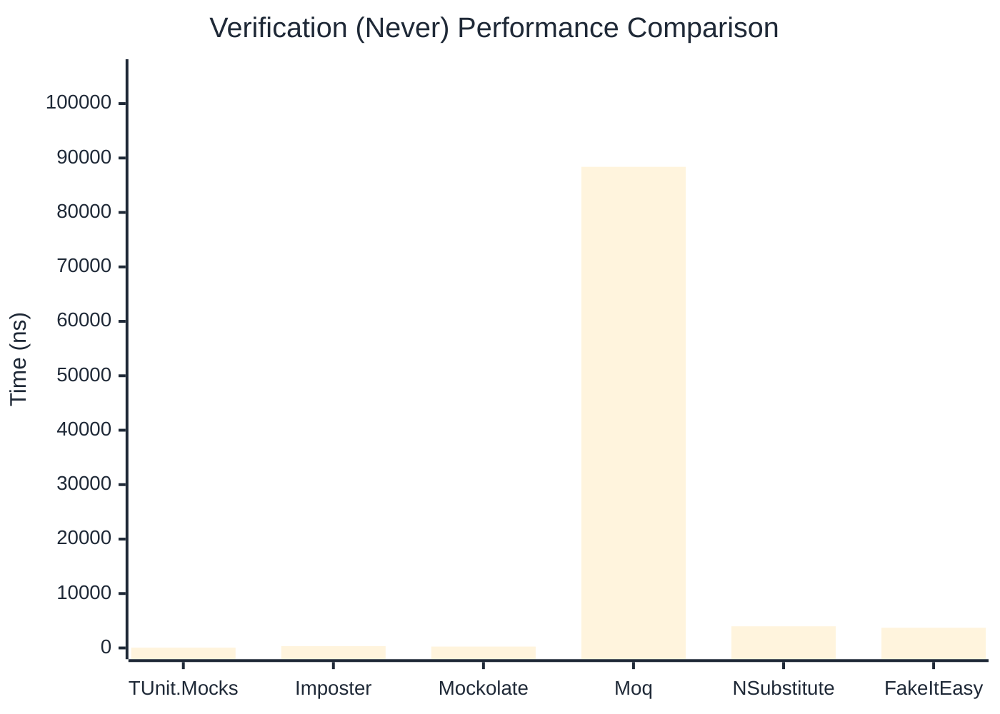

# Verification Benchmark

> Verifying mock method calls — comparing **TUnit.Mocks** (source-generated) against runtime proxy-based mocking libraries.

:::info Last Updated
This benchmark was automatically generated on **2026-10-04** from the latest CI run.

**Environment:** Ubuntu Latest • .NET SDK 10.0.401
:::

## 📊 Results

Verifying mock method calls:

| Library | Mean | Error | StdDev | Allocated |
|---------|------|-------|--------|-----------|
| **TUnit.Mocks** | 739.21 ns | 14.592 ns | 18.974 ns | 3024 B |
| Imposter | 691.43 ns | 13.470 ns | 17.035 ns | 4688 B |
| Mockolate | 412.27 ns | 8.190 ns | 10.933 ns | 2128 B |
| Moq | 341,185.90 ns | 3,098.920 ns | 2,898.731 ns | 24325 B |
| NSubstitute | 7,174.78 ns | 72.888 ns | 68.180 ns | 10064 B |
| FakeItEasy | 7,726.80 ns | 83.818 ns | 78.403 ns | 10722 B |

```mermaid
%%{init: {
  'theme':'base',
  'themeVariables': {
    'primaryColor': '#2563eb',
    'primaryTextColor': '#1f2937',
    'primaryBorderColor': '#1e40af',
    'lineColor': '#6b7280',
    'secondaryColor': '#7c3aed',
    'tertiaryColor': '#dc2626',
    'background': '#ffffff',
    'pie1': '#2563eb',
    'pie2': '#7c3aed',
    'pie3': '#dc2626',
    'pie4': '#f59e0b',
    'pie5': '#10b981',
    'pie6': '#06b6d4',
    'pie7': '#ec4899',
    'pie8': '#6366f1'
  }
}}%%
xychart-beta
  title "Verification Performance Comparison"
  x-axis ["TUnit.Mocks", "Imposter", "Mockolate", "Moq", "NSubstitute", "FakeItEasy"]
  y-axis "Time (ns)" 0 --> 409424
  bar [739.21, 691.43, 412.27, 341185.9, 7174.78, 7726.8]
```

---

### Never

| Library | Mean | Error | StdDev | Allocated |
|---------|------|-------|--------|-----------|
| **TUnit.Mocks** | 54.43 ns | 0.618 ns | 0.578 ns | 320 B |
| Imposter | 346.03 ns | 6.971 ns | 9.772 ns | 2400 B |
| Mockolate | 254.79 ns | 4.107 ns | 3.841 ns | 1144 B |
| Moq | 88,382.32 ns | 231.010 ns | 192.904 ns | 6918 B |
| NSubstitute | 3,976.05 ns | 35.104 ns | 31.118 ns | 7088 B |
| FakeItEasy | 3,712.09 ns | 68.443 ns | 67.220 ns | 5209 B |

```mermaid
%%{init: {
  'theme':'base',
  'themeVariables': {
    'primaryColor': '#2563eb',
    'primaryTextColor': '#1f2937',
    'primaryBorderColor': '#1e40af',
    'lineColor': '#6b7280',
    'secondaryColor': '#7c3aed',
    'tertiaryColor': '#dc2626',
    'background': '#ffffff',
    'pie1': '#2563eb',
    'pie2': '#7c3aed',
    'pie3': '#dc2626',
    'pie4': '#f59e0b',
    'pie5': '#10b981',
    'pie6': '#06b6d4',
    'pie7': '#ec4899',
    'pie8': '#6366f1'
  }
}}%%
xychart-beta
  title "Verification (Never) Performance Comparison"
  x-axis ["TUnit.Mocks", "Imposter", "Mockolate", "Moq", "NSubstitute", "FakeItEasy"]
  y-axis "Time (ns)" 0 --> 106059
  bar [54.43, 346.03, 254.79, 88382.32, 3976.05, 3712.09]
```

---

### Multiple

| Library | Mean | Error | StdDev | Allocated |
|---------|------|-------|--------|-----------|
| **TUnit.Mocks** | 1,339.11 ns | 14.004 ns | 11.694 ns | 4512 B |
| Imposter | 1,850.43 ns | 36.598 ns | 43.567 ns | 11192 B |
| Mockolate | 1,164.49 ns | 21.409 ns | 20.026 ns | 5240 B |
| Moq | 468,755.77 ns | 3,254.720 ns | 3,044.467 ns | 34811 B |
| NSubstitute | 12,728.90 ns | 76.055 ns | 67.421 ns | 16889 B |
| FakeItEasy | 14,099.88 ns | 157.299 ns | 131.352 ns | 19233 B |

```mermaid
%%{init: {
  'theme':'base',
  'themeVariables': {
    'primaryColor': '#2563eb',
    'primaryTextColor': '#1f2937',
    'primaryBorderColor': '#1e40af',
    'lineColor': '#6b7280',
    'secondaryColor': '#7c3aed',
    'tertiaryColor': '#dc2626',
    'background': '#ffffff',
    'pie1': '#2563eb',
    'pie2': '#7c3aed',
    'pie3': '#dc2626',
    'pie4': '#f59e0b',
    'pie5': '#10b981',
    'pie6': '#06b6d4',
    'pie7': '#ec4899',
    'pie8': '#6366f1'
  }
}}%%
xychart-beta
  title "Verification (Multiple) Performance Comparison"
  x-axis ["TUnit.Mocks", "Imposter", "Mockolate", "Moq", "NSubstitute", "FakeItEasy"]
  y-axis "Time (ns)" 0 --> 562507
  bar [1339.11, 1850.43, 1164.49, 468755.77, 12728.9, 14099.88]
```

## 🎯 Key Insights

This benchmark compares **TUnit.Mocks** (source-generated) against runtime proxy-based mocking libraries for verifying mock method calls.

---

:::note Methodology
View the [mock benchmarks overview](/docs/benchmarks/mocks) for methodology details and environment information.
:::

*Last generated: 2026-10-04T03:10:54.658Z*
