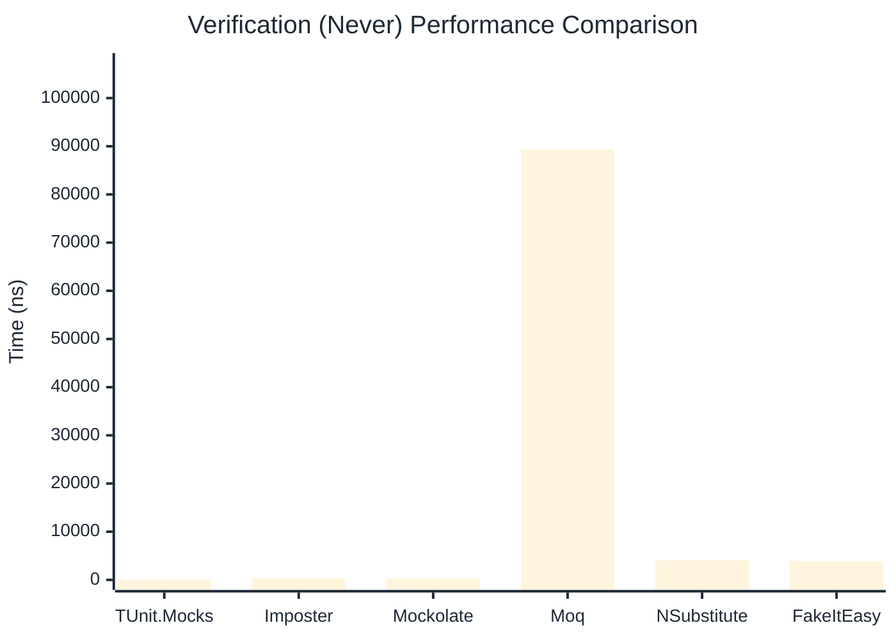

# Verification Benchmark

> Verifying mock method calls — comparing **TUnit.Mocks** (source-generated) against runtime proxy-based mocking libraries.

:::info Last Updated
This benchmark was automatically generated on **2026-10-03** from the latest CI run.

**Environment:** Ubuntu Latest • .NET SDK 10.0.401
:::

## 📊 Results

Verifying mock method calls:

| Library | Mean | Error | StdDev | Allocated |
|---------|------|-------|--------|-----------|
| **TUnit.Mocks** | 773.58 ns | 15.113 ns | 25.250 ns | 3024 B |
| Imposter | 793.41 ns | 15.799 ns | 30.815 ns | 4688 B |
| Mockolate | 450.72 ns | 9.047 ns | 19.281 ns | 2128 B |
| Moq | 346,584.41 ns | 2,514.093 ns | 2,351.684 ns | 24325 B |
| NSubstitute | 7,139.03 ns | 94.352 ns | 78.788 ns | 10064 B |
| FakeItEasy | 7,779.33 ns | 152.656 ns | 149.929 ns | 10722 B |

```mermaid
%%{init: {
  'theme':'base',
  'themeVariables': {
    'primaryColor': '#2563eb',
    'primaryTextColor': '#1f2937',
    'primaryBorderColor': '#1e40af',
    'lineColor': '#6b7280',
    'secondaryColor': '#7c3aed',
    'tertiaryColor': '#dc2626',
    'background': '#ffffff',
    'pie1': '#2563eb',
    'pie2': '#7c3aed',
    'pie3': '#dc2626',
    'pie4': '#f59e0b',
    'pie5': '#10b981',
    'pie6': '#06b6d4',
    'pie7': '#ec4899',
    'pie8': '#6366f1'
  }
}}%%
xychart-beta
  title "Verification Performance Comparison"
  x-axis ["TUnit.Mocks", "Imposter", "Mockolate", "Moq", "NSubstitute", "FakeItEasy"]
  y-axis "Time (ns)" 0 --> 415902
  bar [773.58, 793.41, 450.72, 346584.41, 7139.03, 7779.33]
```

---

### Never

| Library | Mean | Error | StdDev | Allocated |
|---------|------|-------|--------|-----------|
| **TUnit.Mocks** | 54.62 ns | 1.124 ns | 2.821 ns | 320 B |
| Imposter | 342.61 ns | 6.700 ns | 16.561 ns | 2400 B |
| Mockolate | 242.61 ns | 4.735 ns | 6.791 ns | 1144 B |
| Moq | 89,370.83 ns | 725.704 ns | 678.824 ns | 6918 B |
| NSubstitute | 4,094.20 ns | 76.791 ns | 85.353 ns | 7088 B |
| FakeItEasy | 3,850.39 ns | 71.976 ns | 67.327 ns | 5210 B |

```mermaid
%%{init: {
  'theme':'base',
  'themeVariables': {
    'primaryColor': '#2563eb',
    'primaryTextColor': '#1f2937',
    'primaryBorderColor': '#1e40af',
    'lineColor': '#6b7280',
    'secondaryColor': '#7c3aed',
    'tertiaryColor': '#dc2626',
    'background': '#ffffff',
    'pie1': '#2563eb',
    'pie2': '#7c3aed',
    'pie3': '#dc2626',
    'pie4': '#f59e0b',
    'pie5': '#10b981',
    'pie6': '#06b6d4',
    'pie7': '#ec4899',
    'pie8': '#6366f1'
  }
}}%%
xychart-beta
  title "Verification (Never) Performance Comparison"
  x-axis ["TUnit.Mocks", "Imposter", "Mockolate", "Moq", "NSubstitute", "FakeItEasy"]
  y-axis "Time (ns)" 0 --> 107245
  bar [54.62, 342.61, 242.61, 89370.83, 4094.2, 3850.39]
```

---

### Multiple

| Library | Mean | Error | StdDev | Allocated |
|---------|------|-------|--------|-----------|
| **TUnit.Mocks** | 1,265.77 ns | 19.158 ns | 17.921 ns | 4512 B |
| Imposter | 1,967.42 ns | 28.993 ns | 25.701 ns | 11192 B |
| Mockolate | 1,180.84 ns | 23.532 ns | 53.116 ns | 5240 B |
| Moq | 478,999.18 ns | 3,967.981 ns | 3,711.652 ns | 34699 B |
| NSubstitute | 12,488.25 ns | 84.021 ns | 74.483 ns | 16763 B |
| FakeItEasy | 14,382.06 ns | 286.697 ns | 306.763 ns | 19233 B |

```mermaid
%%{init: {
  'theme':'base',
  'themeVariables': {
    'primaryColor': '#2563eb',
    'primaryTextColor': '#1f2937',
    'primaryBorderColor': '#1e40af',
    'lineColor': '#6b7280',
    'secondaryColor': '#7c3aed',
    'tertiaryColor': '#dc2626',
    'background': '#ffffff',
    'pie1': '#2563eb',
    'pie2': '#7c3aed',
    'pie3': '#dc2626',
    'pie4': '#f59e0b',
    'pie5': '#10b981',
    'pie6': '#06b6d4',
    'pie7': '#ec4899',
    'pie8': '#6366f1'
  }
}}%%
xychart-beta
  title "Verification (Multiple) Performance Comparison"
  x-axis ["TUnit.Mocks", "Imposter", "Mockolate", "Moq", "NSubstitute", "FakeItEasy"]
  y-axis "Time (ns)" 0 --> 574800
  bar [1265.77, 1967.42, 1180.84, 478999.18, 12488.25, 14382.06]
```

## 🎯 Key Insights

This benchmark compares **TUnit.Mocks** (source-generated) against runtime proxy-based mocking libraries for verifying mock method calls.

---

:::note Methodology
View the [mock benchmarks overview](/docs/benchmarks/mocks) for methodology details and environment information.
:::

*Last generated: 2026-10-03T02:34:47.768Z*
