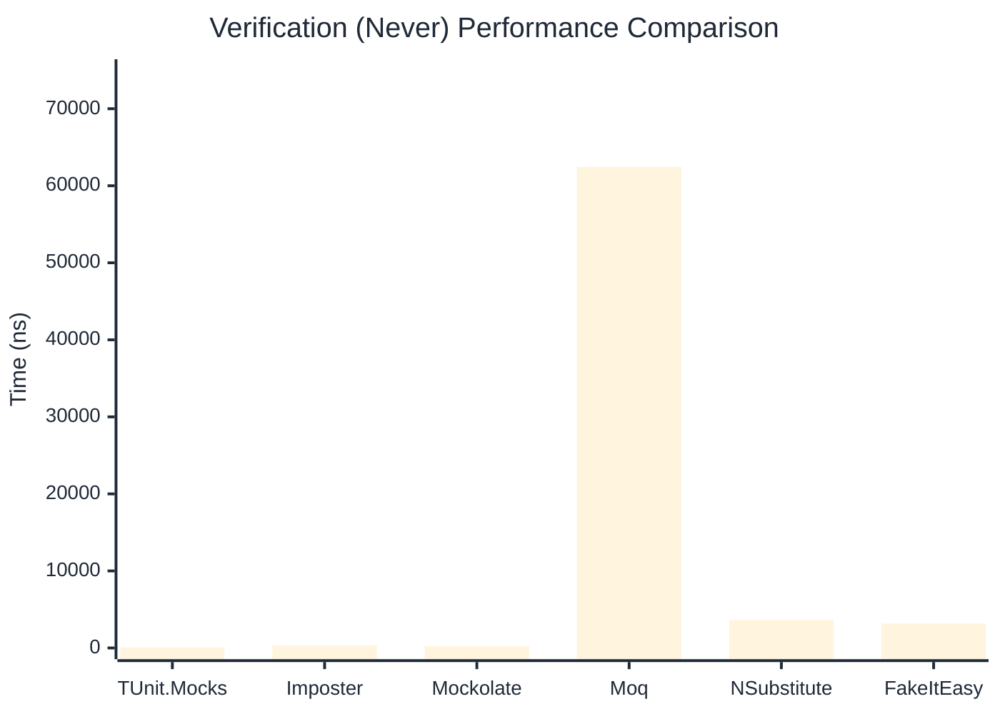

# Verification Benchmark

> Verifying mock method calls — comparing **TUnit.Mocks** (source-generated) against runtime proxy-based mocking libraries.

:::info Last Updated
This benchmark was automatically generated on **2026-10-01** from the latest CI run.

**Environment:** Ubuntu Latest • .NET SDK 10.0.401
:::

## 📊 Results

Verifying mock method calls:

| Library | Mean | Error | StdDev | Allocated |
|---------|------|-------|--------|-----------|
| **TUnit.Mocks** | 773.69 ns | 10.933 ns | 10.226 ns | 3024 B |
| Imposter | 704.06 ns | 7.214 ns | 6.748 ns | 4688 B |
| Mockolate | 401.44 ns | 2.325 ns | 1.942 ns | 2128 B |
| Moq | 247,973.91 ns | 1,336.948 ns | 1,116.412 ns | 24590 B |
| NSubstitute | 6,643.25 ns | 124.703 ns | 122.475 ns | 10064 B |
| FakeItEasy | 6,280.89 ns | 35.514 ns | 29.656 ns | 10722 B |

```mermaid
%%{init: {
  'theme':'base',
  'themeVariables': {
    'primaryColor': '#2563eb',
    'primaryTextColor': '#1f2937',
    'primaryBorderColor': '#1e40af',
    'lineColor': '#6b7280',
    'secondaryColor': '#7c3aed',
    'tertiaryColor': '#dc2626',
    'background': '#ffffff',
    'pie1': '#2563eb',
    'pie2': '#7c3aed',
    'pie3': '#dc2626',
    'pie4': '#f59e0b',
    'pie5': '#10b981',
    'pie6': '#06b6d4',
    'pie7': '#ec4899',
    'pie8': '#6366f1'
  }
}}%%
xychart-beta
  title "Verification Performance Comparison"
  x-axis ["TUnit.Mocks", "Imposter", "Mockolate", "Moq", "NSubstitute", "FakeItEasy"]
  y-axis "Time (ns)" 0 --> 297569
  bar [773.69, 704.06, 401.44, 247973.91, 6643.25, 6280.89]
```

---

### Never

| Library | Mean | Error | StdDev | Allocated |
|---------|------|-------|--------|-----------|
| **TUnit.Mocks** | 54.28 ns | 0.221 ns | 0.196 ns | 320 B |
| Imposter | 334.19 ns | 3.314 ns | 2.767 ns | 2400 B |
| Mockolate | 236.34 ns | 1.092 ns | 0.912 ns | 1144 B |
| Moq | 62,458.93 ns | 646.152 ns | 604.411 ns | 6925 B |
| NSubstitute | 3,629.23 ns | 65.924 ns | 78.478 ns | 7088 B |
| FakeItEasy | 3,172.58 ns | 12.947 ns | 11.477 ns | 5210 B |

```mermaid
%%{init: {
  'theme':'base',
  'themeVariables': {
    'primaryColor': '#2563eb',
    'primaryTextColor': '#1f2937',
    'primaryBorderColor': '#1e40af',
    'lineColor': '#6b7280',
    'secondaryColor': '#7c3aed',
    'tertiaryColor': '#dc2626',
    'background': '#ffffff',
    'pie1': '#2563eb',
    'pie2': '#7c3aed',
    'pie3': '#dc2626',
    'pie4': '#f59e0b',
    'pie5': '#10b981',
    'pie6': '#06b6d4',
    'pie7': '#ec4899',
    'pie8': '#6366f1'
  }
}}%%
xychart-beta
  title "Verification (Never) Performance Comparison"
  x-axis ["TUnit.Mocks", "Imposter", "Mockolate", "Moq", "NSubstitute", "FakeItEasy"]
  y-axis "Time (ns)" 0 --> 74951
  bar [54.28, 334.19, 236.34, 62458.93, 3629.23, 3172.58]
```

---

### Multiple

| Library | Mean | Error | StdDev | Allocated |
|---------|------|-------|--------|-----------|
| **TUnit.Mocks** | 1,287.96 ns | 15.529 ns | 14.526 ns | 4512 B |
| Imposter | 1,727.30 ns | 12.934 ns | 12.099 ns | 11192 B |
| Mockolate | 1,086.57 ns | 17.398 ns | 15.423 ns | 5240 B |
| Moq | 346,822.55 ns | 1,991.836 ns | 1,663.273 ns | 34699 B |
| NSubstitute | 10,985.06 ns | 71.467 ns | 66.850 ns | 16762 B |
| FakeItEasy | 11,401.56 ns | 87.224 ns | 81.590 ns | 19312 B |

```mermaid
%%{init: {
  'theme':'base',
  'themeVariables': {
    'primaryColor': '#2563eb',
    'primaryTextColor': '#1f2937',
    'primaryBorderColor': '#1e40af',
    'lineColor': '#6b7280',
    'secondaryColor': '#7c3aed',
    'tertiaryColor': '#dc2626',
    'background': '#ffffff',
    'pie1': '#2563eb',
    'pie2': '#7c3aed',
    'pie3': '#dc2626',
    'pie4': '#f59e0b',
    'pie5': '#10b981',
    'pie6': '#06b6d4',
    'pie7': '#ec4899',
    'pie8': '#6366f1'
  }
}}%%
xychart-beta
  title "Verification (Multiple) Performance Comparison"
  x-axis ["TUnit.Mocks", "Imposter", "Mockolate", "Moq", "NSubstitute", "FakeItEasy"]
  y-axis "Time (ns)" 0 --> 416188
  bar [1287.96, 1727.3, 1086.57, 346822.55, 10985.06, 11401.56]
```

## 🎯 Key Insights

This benchmark compares **TUnit.Mocks** (source-generated) against runtime proxy-based mocking libraries for verifying mock method calls.

---

:::note Methodology
View the [mock benchmarks overview](/docs/benchmarks/mocks) for methodology details and environment information.
:::

*Last generated: 2026-10-01T02:49:56.169Z*
