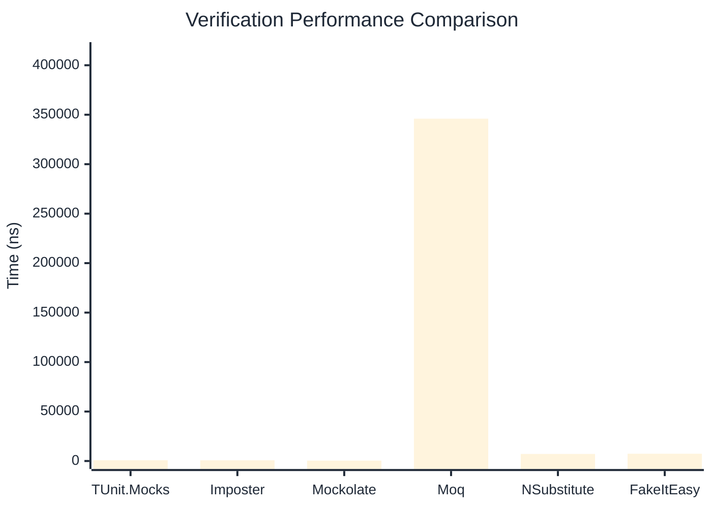
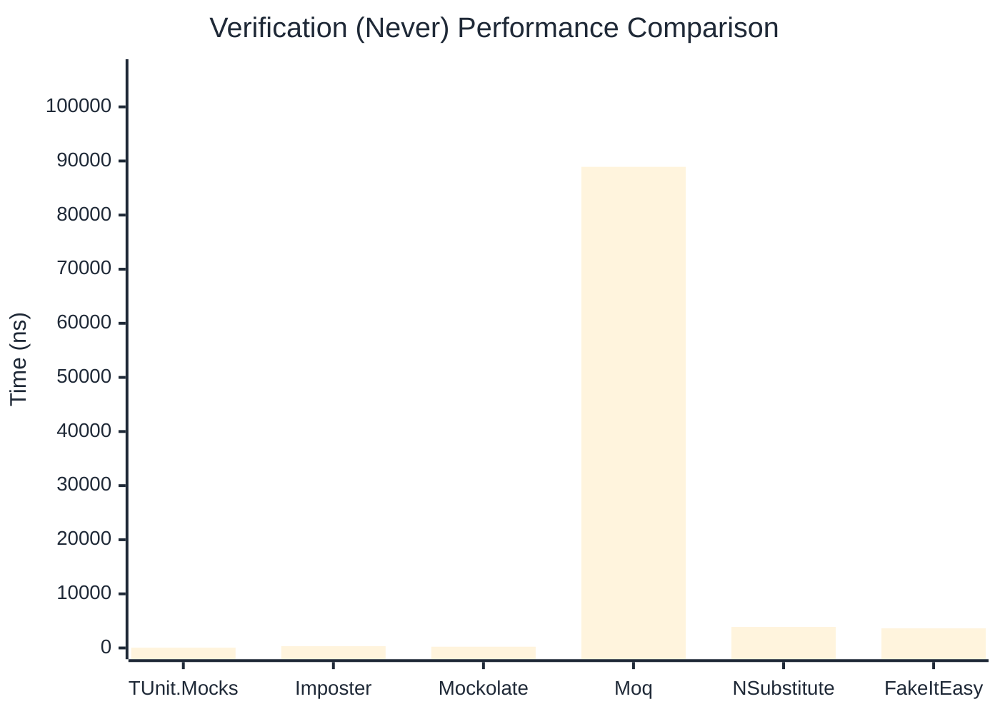
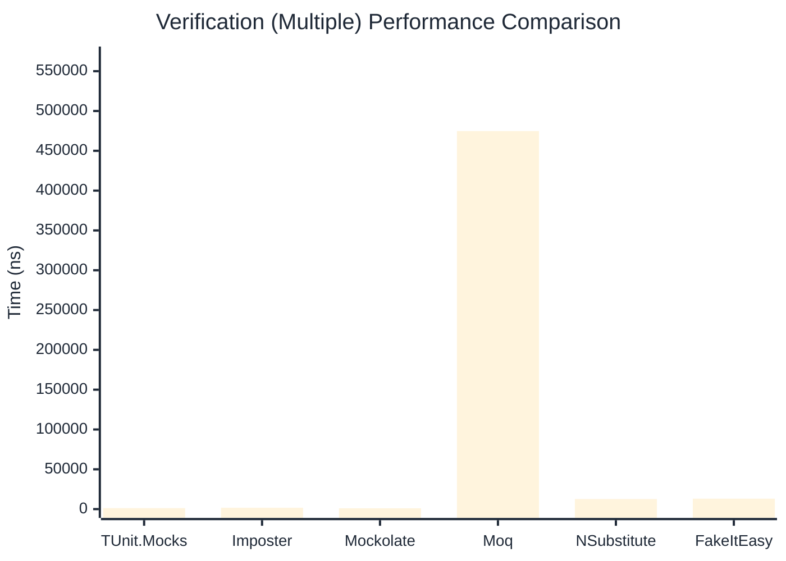

# Verification Benchmark

> Verifying mock method calls — comparing **TUnit.Mocks** (source-generated) against runtime proxy-based mocking libraries.

:::info Last Updated
This benchmark was automatically generated on **2026-10-06** from the latest CI run.

**Environment:** Ubuntu Latest • .NET SDK 10.0.401
:::

## 📊 Results

Verifying mock method calls:

| Library | Mean | Error | StdDev | Allocated |
|---------|------|-------|--------|-----------|
| **TUnit.Mocks** | 757.85 ns | 14.415 ns | 14.803 ns | 3024 B |
| Imposter | 706.52 ns | 13.847 ns | 22.751 ns | 4688 B |
| Mockolate | 397.49 ns | 7.819 ns | 10.961 ns | 2128 B |
| Moq | 345,988.31 ns | 1,384.098 ns | 1,155.785 ns | 24325 B |
| NSubstitute | 7,143.28 ns | 122.988 ns | 115.043 ns | 10064 B |
| FakeItEasy | 7,357.06 ns | 29.220 ns | 24.400 ns | 10722 B |

```mermaid
%%{init: {
  'theme':'base',
  'themeVariables': {
    'primaryColor': '#2563eb',
    'primaryTextColor': '#1f2937',
    'primaryBorderColor': '#1e40af',
    'lineColor': '#6b7280',
    'secondaryColor': '#7c3aed',
    'tertiaryColor': '#dc2626',
    'background': '#ffffff',
    'pie1': '#2563eb',
    'pie2': '#7c3aed',
    'pie3': '#dc2626',
    'pie4': '#f59e0b',
    'pie5': '#10b981',
    'pie6': '#06b6d4',
    'pie7': '#ec4899',
    'pie8': '#6366f1'
  }
}}%%
xychart-beta
  title "Verification Performance Comparison"
  x-axis ["TUnit.Mocks", "Imposter", "Mockolate", "Moq", "NSubstitute", "FakeItEasy"]
  y-axis "Time (ns)" 0 --> 415186
  bar [757.85, 706.52, 397.49, 345988.31, 7143.28, 7357.06]
```

---

### Never

| Library | Mean | Error | StdDev | Allocated |
|---------|------|-------|--------|-----------|
| **TUnit.Mocks** | 52.09 ns | 1.048 ns | 1.076 ns | 320 B |
| Imposter | 322.75 ns | 4.268 ns | 3.784 ns | 2400 B |
| Mockolate | 232.16 ns | 3.450 ns | 3.227 ns | 1144 B |
| Moq | 88,919.21 ns | 529.540 ns | 442.190 ns | 6918 B |
| NSubstitute | 3,881.85 ns | 17.683 ns | 15.676 ns | 7088 B |
| FakeItEasy | 3,622.76 ns | 13.442 ns | 11.225 ns | 5210 B |

```mermaid
%%{init: {
  'theme':'base',
  'themeVariables': {
    'primaryColor': '#2563eb',
    'primaryTextColor': '#1f2937',
    'primaryBorderColor': '#1e40af',
    'lineColor': '#6b7280',
    'secondaryColor': '#7c3aed',
    'tertiaryColor': '#dc2626',
    'background': '#ffffff',
    'pie1': '#2563eb',
    'pie2': '#7c3aed',
    'pie3': '#dc2626',
    'pie4': '#f59e0b',
    'pie5': '#10b981',
    'pie6': '#06b6d4',
    'pie7': '#ec4899',
    'pie8': '#6366f1'
  }
}}%%
xychart-beta
  title "Verification (Never) Performance Comparison"
  x-axis ["TUnit.Mocks", "Imposter", "Mockolate", "Moq", "NSubstitute", "FakeItEasy"]
  y-axis "Time (ns)" 0 --> 106704
  bar [52.09, 322.75, 232.16, 88919.21, 3881.85, 3622.76]
```

---

### Multiple

| Library | Mean | Error | StdDev | Allocated |
|---------|------|-------|--------|-----------|
| **TUnit.Mocks** | 1,247.17 ns | 5.166 ns | 4.832 ns | 4512 B |
| Imposter | 1,677.34 ns | 8.690 ns | 7.257 ns | 11192 B |
| Mockolate | 1,082.03 ns | 13.313 ns | 11.801 ns | 5240 B |
| Moq | 474,794.29 ns | 2,624.619 ns | 2,455.070 ns | 34699 B |
| NSubstitute | 12,689.22 ns | 69.260 ns | 61.397 ns | 16763 B |
| FakeItEasy | 13,173.40 ns | 84.904 ns | 70.899 ns | 19233 B |

```mermaid
%%{init: {
  'theme':'base',
  'themeVariables': {
    'primaryColor': '#2563eb',
    'primaryTextColor': '#1f2937',
    'primaryBorderColor': '#1e40af',
    'lineColor': '#6b7280',
    'secondaryColor': '#7c3aed',
    'tertiaryColor': '#dc2626',
    'background': '#ffffff',
    'pie1': '#2563eb',
    'pie2': '#7c3aed',
    'pie3': '#dc2626',
    'pie4': '#f59e0b',
    'pie5': '#10b981',
    'pie6': '#06b6d4',
    'pie7': '#ec4899',
    'pie8': '#6366f1'
  }
}}%%
xychart-beta
  title "Verification (Multiple) Performance Comparison"
  x-axis ["TUnit.Mocks", "Imposter", "Mockolate", "Moq", "NSubstitute", "FakeItEasy"]
  y-axis "Time (ns)" 0 --> 569754
  bar [1247.17, 1677.34, 1082.03, 474794.29, 12689.22, 13173.4]
```

## 🎯 Key Insights

This benchmark compares **TUnit.Mocks** (source-generated) against runtime proxy-based mocking libraries for verifying mock method calls.

---

:::note Methodology
View the [mock benchmarks overview](/docs/benchmarks/mocks) for methodology details and environment information.
:::

*Last generated: 2026-10-06T02:37:20.591Z*
