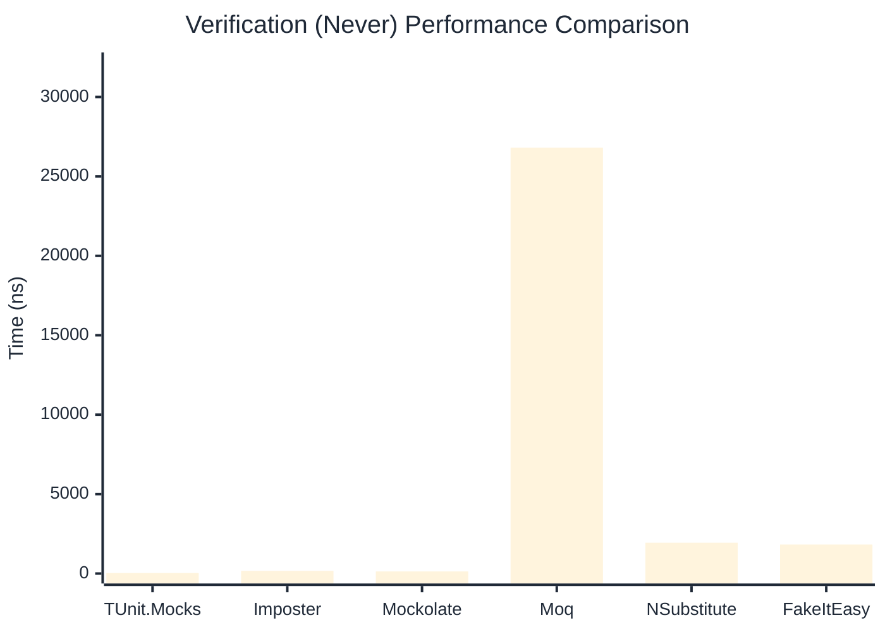

# Verification Benchmark

> Verifying mock method calls — comparing **TUnit.Mocks** (source-generated) against runtime proxy-based mocking libraries.

:::info Last Updated
This benchmark was automatically generated on **2026-10-07** from the latest CI run.

**Environment:** Ubuntu Latest • .NET SDK 10.0.401
:::

## 📊 Results

Verifying mock method calls:

| Library | Mean | Error | StdDev | Allocated |
|---------|------|-------|--------|-----------|
| **TUnit.Mocks** | 427.66 ns | 2.931 ns | 2.598 ns | 3024 B |
| Imposter | 388.42 ns | 7.538 ns | 6.294 ns | 4664 B |
| Mockolate | 252.62 ns | 3.752 ns | 3.133 ns | 2128 B |
| Moq | 106,695.92 ns | 2,018.865 ns | 2,073.226 ns | 24340 B |
| NSubstitute | 3,439.95 ns | 67.806 ns | 99.390 ns | 10064 B |
| FakeItEasy | 3,569.49 ns | 37.126 ns | 28.985 ns | 10722 B |

```mermaid
%%{init: {
  'theme':'base',
  'themeVariables': {
    'primaryColor': '#2563eb',
    'primaryTextColor': '#1f2937',
    'primaryBorderColor': '#1e40af',
    'lineColor': '#6b7280',
    'secondaryColor': '#7c3aed',
    'tertiaryColor': '#dc2626',
    'background': '#ffffff',
    'pie1': '#2563eb',
    'pie2': '#7c3aed',
    'pie3': '#dc2626',
    'pie4': '#f59e0b',
    'pie5': '#10b981',
    'pie6': '#06b6d4',
    'pie7': '#ec4899',
    'pie8': '#6366f1'
  }
}}%%
xychart-beta
  title "Verification Performance Comparison"
  x-axis ["TUnit.Mocks", "Imposter", "Mockolate", "Moq", "NSubstitute", "FakeItEasy"]
  y-axis "Time (ns)" 0 --> 128036
  bar [427.66, 388.42, 252.62, 106695.92, 3439.95, 3569.49]
```

---

### Never

| Library | Mean | Error | StdDev | Allocated |
|---------|------|-------|--------|-----------|
| **TUnit.Mocks** | 32.02 ns | 0.399 ns | 0.373 ns | 320 B |
| Imposter | 169.50 ns | 3.085 ns | 4.894 ns | 2384 B |
| Mockolate | 131.16 ns | 2.378 ns | 1.986 ns | 1144 B |
| Moq | 26,809.43 ns | 472.652 ns | 580.459 ns | 6925 B |
| NSubstitute | 1,942.28 ns | 37.612 ns | 44.775 ns | 7088 B |
| FakeItEasy | 1,829.27 ns | 11.595 ns | 9.683 ns | 5210 B |

```mermaid
%%{init: {
  'theme':'base',
  'themeVariables': {
    'primaryColor': '#2563eb',
    'primaryTextColor': '#1f2937',
    'primaryBorderColor': '#1e40af',
    'lineColor': '#6b7280',
    'secondaryColor': '#7c3aed',
    'tertiaryColor': '#dc2626',
    'background': '#ffffff',
    'pie1': '#2563eb',
    'pie2': '#7c3aed',
    'pie3': '#dc2626',
    'pie4': '#f59e0b',
    'pie5': '#10b981',
    'pie6': '#06b6d4',
    'pie7': '#ec4899',
    'pie8': '#6366f1'
  }
}}%%
xychart-beta
  title "Verification (Never) Performance Comparison"
  x-axis ["TUnit.Mocks", "Imposter", "Mockolate", "Moq", "NSubstitute", "FakeItEasy"]
  y-axis "Time (ns)" 0 --> 32172
  bar [32.02, 169.5, 131.16, 26809.43, 1942.28, 1829.27]
```

---

### Multiple

| Library | Mean | Error | StdDev | Allocated |
|---------|------|-------|--------|-----------|
| **TUnit.Mocks** | 754.96 ns | 12.757 ns | 11.309 ns | 4512 B |
| Imposter | 845.72 ns | 16.799 ns | 28.978 ns | 11144 B |
| Mockolate | 581.50 ns | 6.184 ns | 4.828 ns | 5240 B |
| Moq | 143,879.25 ns | 2,740.438 ns | 2,429.327 ns | 34698 B |
| NSubstitute | 6,179.63 ns | 78.650 ns | 73.569 ns | 16889 B |
| FakeItEasy | 6,329.99 ns | 58.820 ns | 55.021 ns | 19232 B |

```mermaid
%%{init: {
  'theme':'base',
  'themeVariables': {
    'primaryColor': '#2563eb',
    'primaryTextColor': '#1f2937',
    'primaryBorderColor': '#1e40af',
    'lineColor': '#6b7280',
    'secondaryColor': '#7c3aed',
    'tertiaryColor': '#dc2626',
    'background': '#ffffff',
    'pie1': '#2563eb',
    'pie2': '#7c3aed',
    'pie3': '#dc2626',
    'pie4': '#f59e0b',
    'pie5': '#10b981',
    'pie6': '#06b6d4',
    'pie7': '#ec4899',
    'pie8': '#6366f1'
  }
}}%%
xychart-beta
  title "Verification (Multiple) Performance Comparison"
  x-axis ["TUnit.Mocks", "Imposter", "Mockolate", "Moq", "NSubstitute", "FakeItEasy"]
  y-axis "Time (ns)" 0 --> 172656
  bar [754.96, 845.72, 581.5, 143879.25, 6179.63, 6329.99]
```

## 🎯 Key Insights

This benchmark compares **TUnit.Mocks** (source-generated) against runtime proxy-based mocking libraries for verifying mock method calls.

---

:::note Methodology
View the [mock benchmarks overview](/docs/benchmarks/mocks) for methodology details and environment information.
:::

*Last generated: 2026-10-07T02:41:59.908Z*
