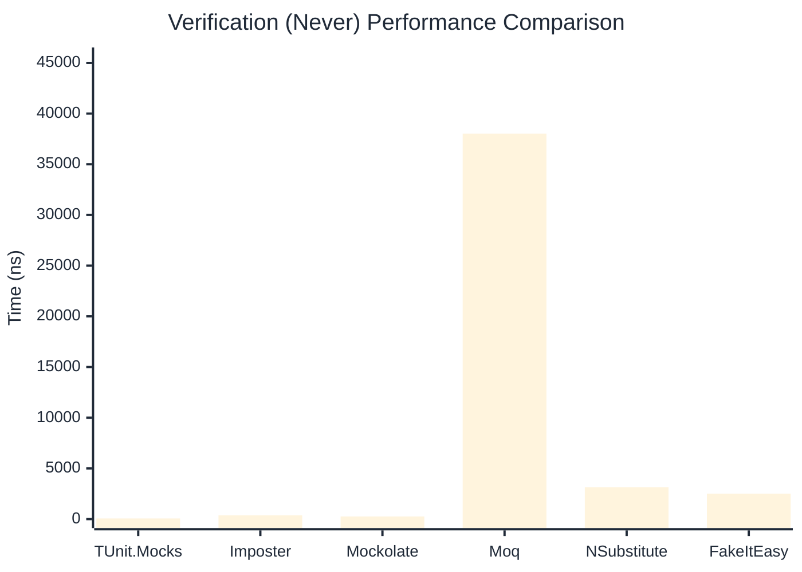

# Verification Benchmark

> Verifying mock method calls — comparing **TUnit.Mocks** (source-generated) against runtime proxy-based mocking libraries.

:::info Last Updated
This benchmark was automatically generated on **2026-10-08** from the latest CI run.

**Environment:** Ubuntu Latest • .NET SDK 10.0.401
:::

## 📊 Results

Verifying mock method calls:

| Library | Mean | Error | StdDev | Allocated |
|---------|------|-------|--------|-----------|
| **TUnit.Mocks** | 768.30 ns | 6.508 ns | 6.088 ns | 3024 B |
| Imposter | 736.12 ns | 13.541 ns | 20.268 ns | 4664 B |
| Mockolate | 467.01 ns | 4.227 ns | 3.954 ns | 2128 B |
| Moq | 155,329.27 ns | 1,104.075 ns | 1,032.752 ns | 24338 B |
| NSubstitute | 6,097.89 ns | 15.238 ns | 14.254 ns | 10064 B |
| FakeItEasy | 5,204.82 ns | 19.489 ns | 18.230 ns | 10717 B |

```mermaid
%%{init: {
  'theme':'base',
  'themeVariables': {
    'primaryColor': '#2563eb',
    'primaryTextColor': '#1f2937',
    'primaryBorderColor': '#1e40af',
    'lineColor': '#6b7280',
    'secondaryColor': '#7c3aed',
    'tertiaryColor': '#dc2626',
    'background': '#ffffff',
    'pie1': '#2563eb',
    'pie2': '#7c3aed',
    'pie3': '#dc2626',
    'pie4': '#f59e0b',
    'pie5': '#10b981',
    'pie6': '#06b6d4',
    'pie7': '#ec4899',
    'pie8': '#6366f1'
  }
}}%%
xychart-beta
  title "Verification Performance Comparison"
  x-axis ["TUnit.Mocks", "Imposter", "Mockolate", "Moq", "NSubstitute", "FakeItEasy"]
  y-axis "Time (ns)" 0 --> 186396
  bar [768.3, 736.12, 467.01, 155329.27, 6097.89, 5204.82]
```

---

### Never

| Library | Mean | Error | StdDev | Allocated |
|---------|------|-------|--------|-----------|
| **TUnit.Mocks** | 62.15 ns | 1.040 ns | 0.973 ns | 320 B |
| Imposter | 370.76 ns | 7.454 ns | 10.925 ns | 2384 B |
| Mockolate | 258.68 ns | 2.493 ns | 2.332 ns | 1144 B |
| Moq | 38,021.40 ns | 368.205 ns | 344.419 ns | 6922 B |
| NSubstitute | 3,135.65 ns | 7.329 ns | 6.120 ns | 7088 B |
| FakeItEasy | 2,511.28 ns | 16.980 ns | 15.052 ns | 5209 B |

```mermaid
%%{init: {
  'theme':'base',
  'themeVariables': {
    'primaryColor': '#2563eb',
    'primaryTextColor': '#1f2937',
    'primaryBorderColor': '#1e40af',
    'lineColor': '#6b7280',
    'secondaryColor': '#7c3aed',
    'tertiaryColor': '#dc2626',
    'background': '#ffffff',
    'pie1': '#2563eb',
    'pie2': '#7c3aed',
    'pie3': '#dc2626',
    'pie4': '#f59e0b',
    'pie5': '#10b981',
    'pie6': '#06b6d4',
    'pie7': '#ec4899',
    'pie8': '#6366f1'
  }
}}%%
xychart-beta
  title "Verification (Never) Performance Comparison"
  x-axis ["TUnit.Mocks", "Imposter", "Mockolate", "Moq", "NSubstitute", "FakeItEasy"]
  y-axis "Time (ns)" 0 --> 45626
  bar [62.15, 370.76, 258.68, 38021.4, 3135.65, 2511.28]
```

---

### Multiple

| Library | Mean | Error | StdDev | Allocated |
|---------|------|-------|--------|-----------|
| **TUnit.Mocks** | 1,281.85 ns | 4.487 ns | 4.197 ns | 4512 B |
| Imposter | 1,875.15 ns | 29.236 ns | 25.917 ns | 11144 B |
| Mockolate | 1,141.21 ns | 5.660 ns | 5.294 ns | 5240 B |
| Moq | 189,625.48 ns | 1,038.300 ns | 920.426 ns | 34584 B |
| NSubstitute | 10,352.21 ns | 44.790 ns | 39.705 ns | 16761 B |
| FakeItEasy | 9,325.13 ns | 76.169 ns | 67.522 ns | 19398 B |

```mermaid
%%{init: {
  'theme':'base',
  'themeVariables': {
    'primaryColor': '#2563eb',
    'primaryTextColor': '#1f2937',
    'primaryBorderColor': '#1e40af',
    'lineColor': '#6b7280',
    'secondaryColor': '#7c3aed',
    'tertiaryColor': '#dc2626',
    'background': '#ffffff',
    'pie1': '#2563eb',
    'pie2': '#7c3aed',
    'pie3': '#dc2626',
    'pie4': '#f59e0b',
    'pie5': '#10b981',
    'pie6': '#06b6d4',
    'pie7': '#ec4899',
    'pie8': '#6366f1'
  }
}}%%
xychart-beta
  title "Verification (Multiple) Performance Comparison"
  x-axis ["TUnit.Mocks", "Imposter", "Mockolate", "Moq", "NSubstitute", "FakeItEasy"]
  y-axis "Time (ns)" 0 --> 227551
  bar [1281.85, 1875.15, 1141.21, 189625.48, 10352.21, 9325.13]
```

## 🎯 Key Insights

This benchmark compares **TUnit.Mocks** (source-generated) against runtime proxy-based mocking libraries for verifying mock method calls.

---

:::note Methodology
View the [mock benchmarks overview](/docs/benchmarks/mocks) for methodology details and environment information.
:::

*Last generated: 2026-10-08T02:41:51.713Z*
