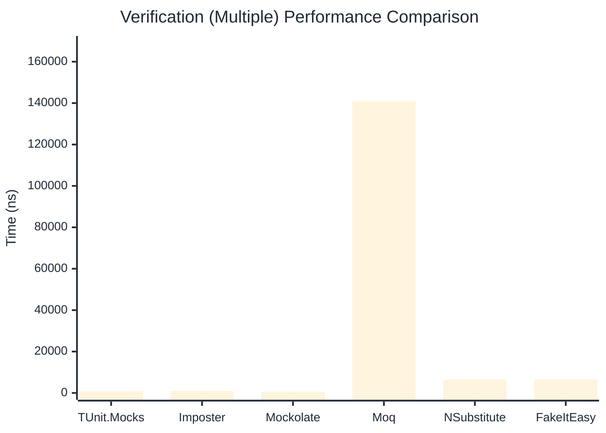

# Verification Benchmark

> Verifying mock method calls — comparing **TUnit.Mocks** (source-generated) against runtime proxy-based mocking libraries.

:::info Last Updated
This benchmark was automatically generated on **2026-10-05** from the latest CI run.

**Environment:** Ubuntu Latest • .NET SDK 10.0.401
:::

## 📊 Results

Verifying mock method calls:

| Library | Mean | Error | StdDev | Allocated |
|---------|------|-------|--------|-----------|
| **TUnit.Mocks** | 432.43 ns | 4.594 ns | 3.836 ns | 3024 B |
| Imposter | 378.12 ns | 7.018 ns | 6.564 ns | 4688 B |
| Mockolate | 243.58 ns | 2.920 ns | 2.589 ns | 2128 B |
| Moq | 111,059.45 ns | 2,199.680 ns | 2,533.154 ns | 24340 B |
| NSubstitute | 3,530.49 ns | 60.541 ns | 67.291 ns | 10064 B |
| FakeItEasy | 3,663.21 ns | 73.009 ns | 78.118 ns | 10722 B |

```mermaid
%%{init: {
  'theme':'base',
  'themeVariables': {
    'primaryColor': '#2563eb',
    'primaryTextColor': '#1f2937',
    'primaryBorderColor': '#1e40af',
    'lineColor': '#6b7280',
    'secondaryColor': '#7c3aed',
    'tertiaryColor': '#dc2626',
    'background': '#ffffff',
    'pie1': '#2563eb',
    'pie2': '#7c3aed',
    'pie3': '#dc2626',
    'pie4': '#f59e0b',
    'pie5': '#10b981',
    'pie6': '#06b6d4',
    'pie7': '#ec4899',
    'pie8': '#6366f1'
  }
}}%%
xychart-beta
  title "Verification Performance Comparison"
  x-axis ["TUnit.Mocks", "Imposter", "Mockolate", "Moq", "NSubstitute", "FakeItEasy"]
  y-axis "Time (ns)" 0 --> 133272
  bar [432.43, 378.12, 243.58, 111059.45, 3530.49, 3663.21]
```

---

### Never

| Library | Mean | Error | StdDev | Allocated |
|---------|------|-------|--------|-----------|
| **TUnit.Mocks** | 33.39 ns | 0.660 ns | 0.707 ns | 320 B |
| Imposter | 173.66 ns | 3.421 ns | 5.326 ns | 2400 B |
| Mockolate | 131.50 ns | 2.530 ns | 3.107 ns | 1144 B |
| Moq | 26,992.11 ns | 428.471 ns | 400.792 ns | 6925 B |
| NSubstitute | 1,979.57 ns | 25.886 ns | 22.947 ns | 7088 B |
| FakeItEasy | 1,835.18 ns | 34.686 ns | 32.446 ns | 5210 B |

```mermaid
%%{init: {
  'theme':'base',
  'themeVariables': {
    'primaryColor': '#2563eb',
    'primaryTextColor': '#1f2937',
    'primaryBorderColor': '#1e40af',
    'lineColor': '#6b7280',
    'secondaryColor': '#7c3aed',
    'tertiaryColor': '#dc2626',
    'background': '#ffffff',
    'pie1': '#2563eb',
    'pie2': '#7c3aed',
    'pie3': '#dc2626',
    'pie4': '#f59e0b',
    'pie5': '#10b981',
    'pie6': '#06b6d4',
    'pie7': '#ec4899',
    'pie8': '#6366f1'
  }
}}%%
xychart-beta
  title "Verification (Never) Performance Comparison"
  x-axis ["TUnit.Mocks", "Imposter", "Mockolate", "Moq", "NSubstitute", "FakeItEasy"]
  y-axis "Time (ns)" 0 --> 32391
  bar [33.39, 173.66, 131.5, 26992.11, 1979.57, 1835.18]
```

---

### Multiple

| Library | Mean | Error | StdDev | Allocated |
|---------|------|-------|--------|-----------|
| **TUnit.Mocks** | 766.50 ns | 7.528 ns | 6.287 ns | 4512 B |
| Imposter | 937.25 ns | 18.520 ns | 20.585 ns | 11192 B |
| Mockolate | 615.03 ns | 12.256 ns | 18.717 ns | 5240 B |
| Moq | 140,937.29 ns | 827.669 ns | 646.190 ns | 34698 B |
| NSubstitute | 6,445.11 ns | 116.173 ns | 108.668 ns | 16889 B |
| FakeItEasy | 6,453.61 ns | 128.683 ns | 107.456 ns | 19232 B |

```mermaid
%%{init: {
  'theme':'base',
  'themeVariables': {
    'primaryColor': '#2563eb',
    'primaryTextColor': '#1f2937',
    'primaryBorderColor': '#1e40af',
    'lineColor': '#6b7280',
    'secondaryColor': '#7c3aed',
    'tertiaryColor': '#dc2626',
    'background': '#ffffff',
    'pie1': '#2563eb',
    'pie2': '#7c3aed',
    'pie3': '#dc2626',
    'pie4': '#f59e0b',
    'pie5': '#10b981',
    'pie6': '#06b6d4',
    'pie7': '#ec4899',
    'pie8': '#6366f1'
  }
}}%%
xychart-beta
  title "Verification (Multiple) Performance Comparison"
  x-axis ["TUnit.Mocks", "Imposter", "Mockolate", "Moq", "NSubstitute", "FakeItEasy"]
  y-axis "Time (ns)" 0 --> 169125
  bar [766.5, 937.25, 615.03, 140937.29, 6445.11, 6453.61]
```

## 🎯 Key Insights

This benchmark compares **TUnit.Mocks** (source-generated) against runtime proxy-based mocking libraries for verifying mock method calls.

---

:::note Methodology
View the [mock benchmarks overview](/docs/benchmarks/mocks) for methodology details and environment information.
:::

*Last generated: 2026-10-05T02:45:14.260Z*
