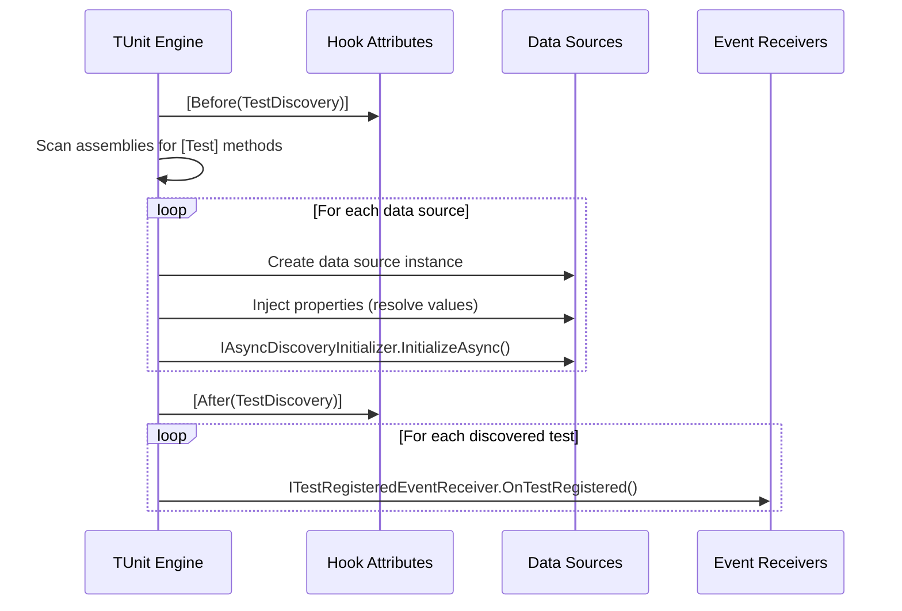
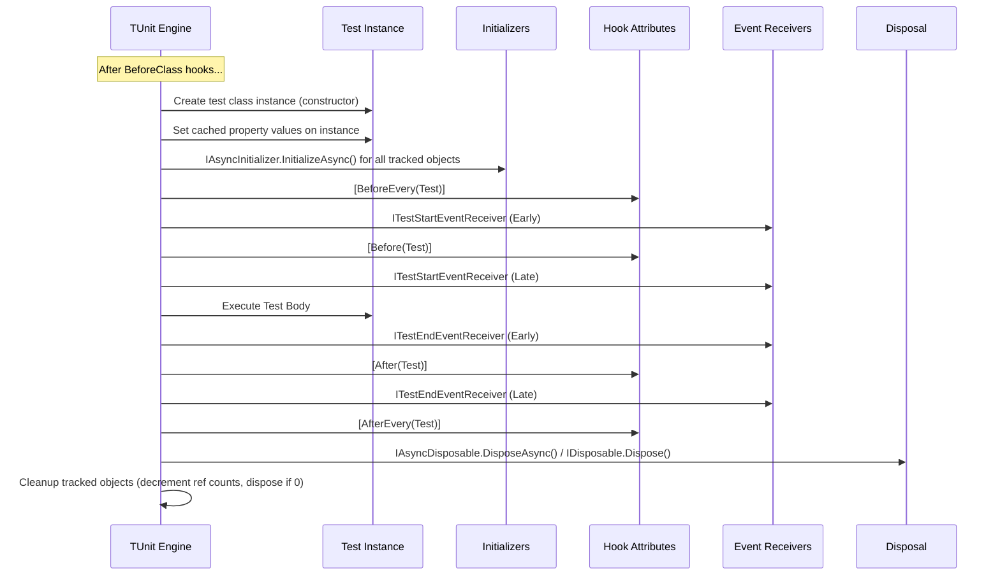
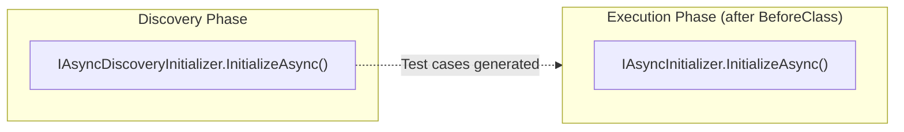
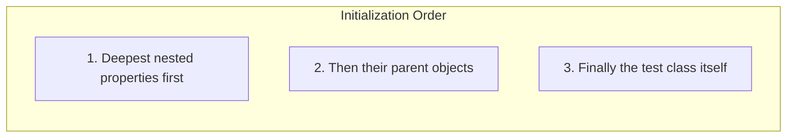
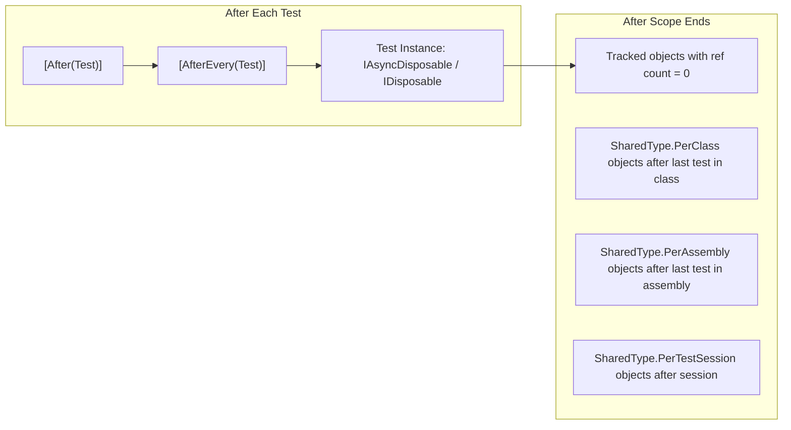
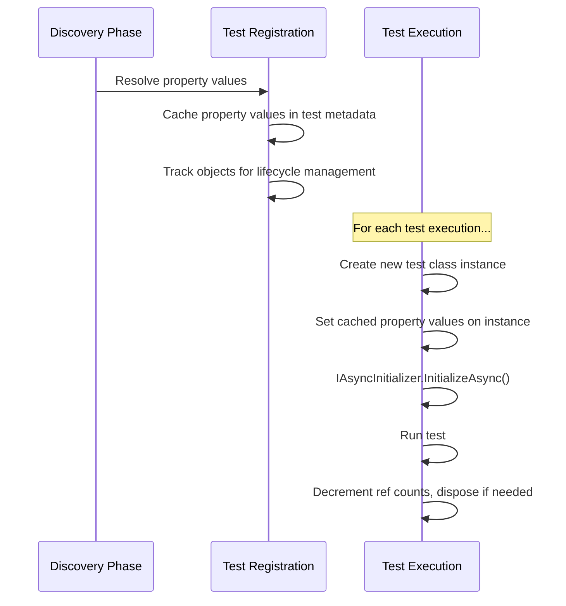
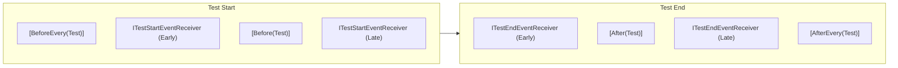

# Test Lifecycle Overview

Understanding TUnit's complete test lifecycle helps you write effective tests and place setup/cleanup logic in the right place. TUnit provides multiple mechanisms for hooking into the lifecycle:

1. **Hook Attributes** (`[Before]`, `[After]`, etc.) - Method-based hooks
2. **Event Receivers** (interfaces like `ITestStartEventReceiver`) - Object-based event subscriptions
3. **Initialization Interfaces** (`IAsyncInitializer`, `IAsyncDiscoveryInitializer`) - Async object setup
4. **Disposal Interfaces** (`IDisposable`, `IAsyncDisposable`) - Resource cleanup

This page provides a complete visual overview of when each mechanism executes.

## Complete Lifecycle Diagram

```mermaid
flowchart TB
    subgraph Discovery["1. Discovery Phase"]
        direction TB
        D1["[Before(TestDiscovery)]"]
        D2["Scan assemblies for [Test] methods"]
        D3["Create data sources & resolve property values"]
        D3a["IAsyncDiscoveryInitializer.InitializeAsync()"]
        D4["[After(TestDiscovery)]"]
        D5["ITestRegisteredEventReceiver.OnTestRegistered()"]
        D1 --> D2 --> D3 --> D3a --> D4 --> D5
    end

    subgraph Session["2. Test Session Execution"]
        direction TB
        S1["[Before(TestSession)]"]
        S1a["IFirstTestInTestSessionEventReceiver"]

        subgraph Assembly["Per Assembly"]
            direction TB
            A1["[BeforeEvery(Assembly)] / [Before(Assembly)]"]
            A1a["IFirstTestInAssemblyEventReceiver"]

            subgraph Class["Per Class"]
                direction TB
                C1["[BeforeEvery(Class)] / [Before(Class)]"]
                C1a["IFirstTestInClassEventReceiver"]

                subgraph Test["Per Test Execution"]
                    direction TB
                    T0["Create test class instance (constructor)"]
                    T0a["Set injected property values on instance"]
                    T0b["IAsyncInitializer.InitializeAsync()"]
                    T1["[BeforeEvery(Test)]"]
                    T1a["ITestStartEventReceiver (Early)"]
                    T2["[Before(Test)]"]
                    T2a["ITestStartEventReceiver (Late)"]
                    T3["Test Body"]
                    T3a["ITestEndEventReceiver (Early)"]
                    T4["[After(Test)]"]
                    T4a["ITestEndEventReceiver (Late)"]
                    T5["[AfterEvery(Test)]"]
                    T6["IDisposable / IAsyncDisposable"]
                    T7["Cleanup tracked objects"]

                    T0 --> T0a --> T0b --> T1
                    T1 --> T1a --> T2 --> T2a --> T3
                    T3 --> T3a --> T4 --> T4a --> T5 --> T6 --> T7
                end

                C2a["ILastTestInClassEventReceiver"]
                C2["[After(Class)] / [AfterEvery(Class)]"]
                C1 --> C1a --> Test --> C2a --> C2
            end

            A2a["ILastTestInAssemblyEventReceiver"]
            A2["[After(Assembly)] / [AfterEvery(Assembly)]"]
            A1 --> A1a --> Class --> A2a --> A2
        end

        S2a["ILastTestInTestSessionEventReceiver"]
        S2["[After(TestSession)]"]
        S1 --> S1a --> Assembly --> S2a --> S2
    end

    Discovery --> Session

    style D2 fill:#e1f5fe
    style D3a fill:#fff3e0
    style T0b fill:#fff3e0
    style T3 fill:#c8e6c9
    style T6 fill:#ffcdd2
```



## Phase 1: Test Discovery

Before any tests execute, TUnit discovers all tests and prepares data sources.



### Discovery Phase Details

| Step | What Happens |
|------|-------------|
| `[Before(TestDiscovery)]` | Hook runs once before discovery begins |
| **Scan Assemblies** | Find all methods with `[Test]` attribute |
| **Create Data Sources** | Instantiate `ClassDataSource<T>`, resolve `MethodDataSource`, etc. |
| **Property Injection** | Resolve and cache property values for data sources |
| `IAsyncDiscoveryInitializer` | Initialize objects that need to be ready during discovery |
| `[After(TestDiscovery)]` | Hook runs once after discovery completes |
| `OnTestRegistered` | Event fires for each test after registration |

:::warning Discovery vs Execution
`IAsyncInitializer` does **NOT** run during discovery. Only `IAsyncDiscoveryInitializer` runs at discovery time.

Use `IAsyncDiscoveryInitializer` when your data source needs async initialization to generate test cases (e.g., loading test data from a database).
:::

## Phase 2: Test Execution

### Per-Test Execution Flow



### Complete Test Execution Order

Here's the exact order of operations for a single test:

| Order | What Happens | Type |
|-------|-------------|------|
| 1 | `[Before(TestSession)]` | Hook (once per session) |
| 2 | `IFirstTestInTestSessionEventReceiver` | Event (once per session) |
| 3 | `[BeforeEvery(Assembly)]` / `[Before(Assembly)]` | Hooks (once per assembly) |
| 4 | `IFirstTestInAssemblyEventReceiver` | Event (once per assembly) |
| 5 | `[BeforeEvery(Class)]` / `[Before(Class)]` | Hooks (once per class) |
| 6 | `IFirstTestInClassEventReceiver` | Event (once per class) |
| 7 | **Create test class instance** | Constructor runs |
| 8 | **Set property values on instance** | Cached values applied |
| 9 | **`IAsyncInitializer.InitializeAsync()`** | All tracked objects initialized |
| 10 | `[BeforeEvery(Test)]` | Hook |
| 11 | `ITestStartEventReceiver` (Early) | Event |
| 12 | `[Before(Test)]` | Hook (instance method) |
| 13 | `ITestStartEventReceiver` (Late) | Event |
| 14 | **Test Body Execution** | Your test code runs |
| 15 | `ITestEndEventReceiver` (Early) | Event |
| 16 | `[After(Test)]` | Hook (instance method) |
| 17 | `ITestEndEventReceiver` (Late) | Event |
| 18 | `[AfterEvery(Test)]` | Hook |
| 19 | **`IAsyncDisposable` / `IDisposable`** | Test instance disposed |
| 20 | **Cleanup tracked objects** | Ref count decremented, dispose if 0 |
| 21 | `ILastTestInClassEventReceiver` | Event (after last test in class) |
| 22 | `[After(Class)]` / `[AfterEvery(Class)]` | Hooks (after last test in class) |
| 23 | `ILastTestInAssemblyEventReceiver` | Event (after last test in assembly) |
| 24 | `[After(Assembly)]` / `[AfterEvery(Assembly)]` | Hooks (after last test in assembly) |
| 25 | `ILastTestInTestSessionEventReceiver` | Event (after last test in session) |
| 26 | `[After(TestSession)]` | Hook (once per session) |

## Initialization Interfaces

### IAsyncInitializer vs IAsyncDiscoveryInitializer



| Interface | When It Runs | Use Case |
|-----------|-------------|----------|
| `IAsyncDiscoveryInitializer` | During test discovery | Loading data for test case generation |
| `IAsyncInitializer` | During test execution (after `[Before(Class)]`) | Starting containers, DB connections |

### Initialization Order

Objects are initialized **depth-first** (deepest nested objects first):



```csharp
// If TestClass has PropertyA, and PropertyA has PropertyB...
// Initialization order: PropertyB → PropertyA → TestClass
```

## Disposal Interfaces

### When Disposal Happens



### Disposal by Sharing Type

| SharedType | When Disposed |
|------------|--------------|
| `None` (default) | After each test |
| `PerClass` | After last test in the class |
| `PerAssembly` | After last test in the assembly |
| `PerTestSession` | After test session ends |
| `Keyed` | When all tests using that key complete |

## Property Injection Lifecycle



### Key Points

1. **Property values are resolved once** during test registration
2. **Shared objects** (`PerClass`, `PerAssembly`, etc.) are created once and reused
3. **Each test gets a new instance** of the test class
4. **Cached values are set** on each new test instance
5. **`IAsyncInitializer`** runs after `[Before(Class)]` hooks

## Event Receiver Interfaces

### All Event Receiver Interfaces

| Interface | When Fired | Context |
|-----------|------------|---------|
| `ITestRegisteredEventReceiver` | After test discovered | `TestRegisteredContext` |
| `IFirstTestInTestSessionEventReceiver` | Before first test in session | `TestSessionContext` |
| `IFirstTestInAssemblyEventReceiver` | Before first test in assembly | `AssemblyHookContext` |
| `IFirstTestInClassEventReceiver` | Before first test in class | `ClassHookContext` |
| `ITestStartEventReceiver` | When test begins | `TestContext` |
| `ITestEndEventReceiver` | When test completes | `TestContext` |
| `ITestSkippedEventReceiver` | When test is skipped | `TestContext` |
| `ILastTestInClassEventReceiver` | After last test in class | `ClassHookContext` |
| `ILastTestInAssemblyEventReceiver` | After last test in assembly | `AssemblyHookContext` |
| `ILastTestInTestSessionEventReceiver` | After last test in session | `TestSessionContext` |

### Early vs Late Stage

For `ITestStartEventReceiver` and `ITestEndEventReceiver`:



```csharp
public class MyAttribute : Attribute, ITestStartEventReceiver
{
    // Early = runs BEFORE [Before(Test)]
    // Late (default) = runs AFTER [Before(Test)]
    public EventReceiverStage Stage => EventReceiverStage.Early;

    public ValueTask OnTestStart(TestContext context) => ValueTask.CompletedTask;
}
```

## Hook Attributes Reference

### All Hook Types

| Level | Before | After | Method Type |
|-------|--------|-------|-------------|
| Test Discovery | `[Before(TestDiscovery)]` | `[After(TestDiscovery)]` | Static |
| Test Session | `[Before(TestSession)]` | `[After(TestSession)]` | Static |
| Assembly | `[Before(Assembly)]` | `[After(Assembly)]` | Static |
| Class | `[Before(Class)]` | `[After(Class)]` | Static |
| Test | `[Before(Test)]` | `[After(Test)]` | **Instance** |

### Before vs BeforeEvery

| Attribute | Scope |
|-----------|-------|
| `[Before(Class)]` | Once for **this class only** |
| `[BeforeEvery(Class)]` | Before **every class** in session |
| `[Before(Test)]` | Before **each test in this class** |
| `[BeforeEvery(Test)]` | Before **every test** in session |

## Quick Reference

```
┌─ DISCOVERY ──────────────────────────────────────────────────────┐
│ [Before(TestDiscovery)]                                          │
│ → Scan assemblies for [Test] methods                             │
│ → Create data sources, inject properties                         │
│ → IAsyncDiscoveryInitializer.InitializeAsync()                   │
│ [After(TestDiscovery)]                                           │
│ → ITestRegisteredEventReceiver.OnTestRegistered (per test)       │
└──────────────────────────────────────────────────────────────────┘
                              │
                              ▼
┌─ TEST SESSION ───────────────────────────────────────────────────┐
│ [Before(TestSession)] → IFirstTestInTestSessionEventReceiver     │
│   │                                                               │
│   ├─ [Before(Assembly)] → IFirstTestInAssemblyEventReceiver      │
│   │   │                                                           │
│   │   ├─ [Before(Class)] → IFirstTestInClassEventReceiver        │
│   │   │   │                                                       │
│   │   │   │  ┌─ PER TEST ─────────────────────────────────────┐  │
│   │   │   │  │ Create instance (constructor)                   │  │
│   │   │   │  │ Set property values                             │  │
│   │   │   │  │ IAsyncInitializer.InitializeAsync()             │  │
│   │   │   │  │ [BeforeEvery(Test)]                             │  │
│   │   │   │  │ ITestStartEventReceiver (Early)                 │  │
│   │   │   │  │ [Before(Test)]                                  │  │
│   │   │   │  │ ITestStartEventReceiver (Late)                  │  │
│   │   │   │  │ ─────────── TEST BODY ───────────               │  │
│   │   │   │  │ ITestEndEventReceiver (Early)                   │  │
│   │   │   │  │ [After(Test)]                                   │  │
│   │   │   │  │ ITestEndEventReceiver (Late)                    │  │
│   │   │   │  │ [AfterEvery(Test)]                              │  │
│   │   │   │  │ IAsyncDisposable / IDisposable                  │  │
│   │   │   │  │ Cleanup tracked objects                         │  │
│   │   │   │  └─────────────────────────────────────────────────┘  │
│   │   │   │                                                       │
│   │   │   ├─ ILastTestInClassEventReceiver → [After(Class)]      │
│   │   │                                                           │
│   │   ├─ ILastTestInAssemblyEventReceiver → [After(Assembly)]    │
│   │                                                               │
│   ├─ ILastTestInTestSessionEventReceiver → [After(TestSession)]  │
└───────────────────────────────────────────────────────────────────┘
```

## Exception Handling

:::tip Cleanup Always Runs
All `[After]` hooks, `ITestEndEventReceiver` events, and disposal methods run even if earlier ones fail. Exceptions are collected and thrown together.
:::

| Phase | Behavior |
|-------|----------|
| Before hooks | Fail fast (exception stops execution) |
| After hooks | Run all, collect exceptions |
| Disposal | Always runs, exceptions collected |

## Related Pages

- [Test Set Ups](setup.md) - Detailed guide to `[Before]` hooks
- [Test Clean Ups](cleanup.md) - Detailed guide to `[After]` hooks
- [Event Subscribing](event-subscribing.md) - Event receiver interfaces
- [Property Injection](property-injection.md) - Property injection and `IAsyncInitializer`
- [Dependency Injection](dependency-injection.md) - DI integration
- [Test Context](test-context.md) - Accessing test information
